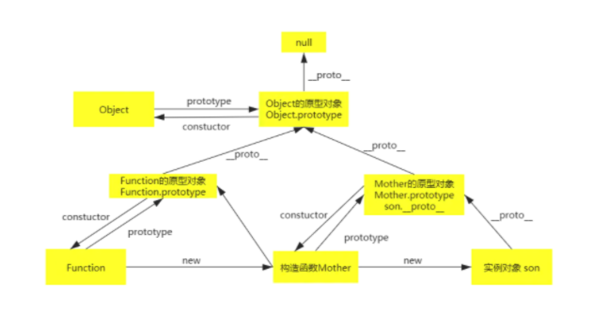

# 类
## 构造函数
### 构造函数分为实例成员和静态成员
实例成员：实例成员就是在构造函数内部，通过this添加的成员，实例成员只能通过实例化的对象来访问

静态成员：在构造函数本身上添加的成员，只能通过构造函数来访问，对于es6来说就是属于类的，而不属于实例对象

````js
function  Star(name, age) {
    // 实例成员
    this.name = name
    this.age = age
}
// 静态成员
Star.sex = '女'

let stars = new Star('小红', 18)
console.log(stars) // Star {name: '小红'， age: 18}
console.log(stars.sex)  // undefined 实例无法访问sex属性，只能通过构造函数来访问
````

```js
console.log(stars) // Star {name: '小红'， age: 18}
```
为什么stars是实例对象输出的反而是Star {name: '小红'， age: 18}的？

本身输出的确实是实例对象，但是前面的Star是代表的是这个实例是由哪个类new出来的

### 通过构造函数创建对象 --- 该过程也叫实例化
#### 如何通过构造函数创建一个对象？
```js
function Father(name) {
    this.name = name 
}
let son = new Father('Lis')
console.log(son) // Father {name: 'Lis'}
```
此时，son就是一个新对象

#### new一个新对象的过程，发生了什么？
```
1、创建一个空对象{}
2、为son准备原型链连接son.__proto__ = Father.prototype
3、重新绑定this，使构造函数的this指向新对象Father.call(this)
4、为新对象属性赋值son.name
5、返回this return this，此时的新对象就拥有了构造函数的方法和属性了
```

#### 每个实例的方法是共享的吗？
1、在构造函数上直接定义方法 --- 不共享
````js
function Star(name, age) {
    this.sing = function() {
        console.log('i love you')
    }
}
let stu1 = new Star()
let stu2 = new Star()
stu1.sing() // i love you
stu2.sing() // i love you
console.log(stu1.sing === stu2.sing) //  false
````
很明显，stu1和stu2指向的不是一个地方，所以在构造函数上通过this来添加的方法的方法来生成实例，每次生成实例，都是新开辟一个内存空间存方法，这样会导致内存的极大浪费，从而影响性能

2、通过原型添加方法 --- 共享
构造函数通过原型分配的函数，是所有对象共享的
````js
function Star(name) {
    this.name = name;
}
Star.prototype.sing = function () {
    console.log('我爱唱歌', this.name);
};
let stu1 = new Star('小红');
let stu2 = new Star('小蓝');
stu1.sing();//我爱唱歌 小红
stu2.sing();//我爱唱歌 小蓝
console.log(stu1.sing === stu2.sing);//true
````

#### 实例的属性为基本类型时，它们是共享的吗？
属性存储的是如果存储的是基本类型，不存在共享问题，是否相同要看值内容
````js
let stu1 = new Star('小红');
let stu2 = new Star('小红');
console.log(stu1.name === stu2.name);//true

let stu1 = new Star('小红');
let stu2 = new Star('小蓝');
console.log(stu1.name === stu2.name);//false
````

#### 定义构造函数的规则
公共属性定义到构造函数内，公共方法放到原型对象上

## 原型
### 什么是原型？
Father.prototype 就是原型，它是一个对象，我们也称它为原型对象

### 原型的作用是什么？
原型的作用就是共享方法，通过Father.prototype.method可以共享方法，不会反复开辟空间存储方法

### 原型中的this的指向是什么？
原型中的this的指向是实例

## 原型链
### 什么是原型链？
原型与原型层层相连接的过程即为原型链

### 原型链应用
对象可以使用构造函数prototype原型对象的属性和方法，就是因为对象有__proto__原型的存在，每个对象都有__proto__原型的存在

````js
function Star(name, age) {
    this.name = name;
    this.age = age;
}
Star.prototype.dance = function() {
    console.log('我在跳舞')
}
let obj = new Star('张萌', 18)
console.log(obj.__proto__ === Star.prototype)
````

### 原型链图



### 原型查找方式
例如查找obj的dance方法
```js
function Star(name) {
    this.name = name
    
    // 1、首先看obj对象身上是否有dance方法，如果有，则执行对象身上的方法
    this.dance = function() {
        console.log(this.name + '1')
    }
}
// 2、如果没有dance方法，就去构造函数原型对象prototype身上去查找dance这个方法
Star.prototype.dance = function() {
  console.log(this.name + '2')
}

// 3、如果在没有dance这个方法，就去Object原型对象prototype身上去查找dance方法，
Object.prototype.dance = function(){
   console.log(this.name + '3')
}
// 如果在没有，则会报错
let obj = new Star('小红')
obj.dance()
```


## ES6
### 构造器
理论上是可以不写的

构造器中的this是谁？--- 类的实例对象
