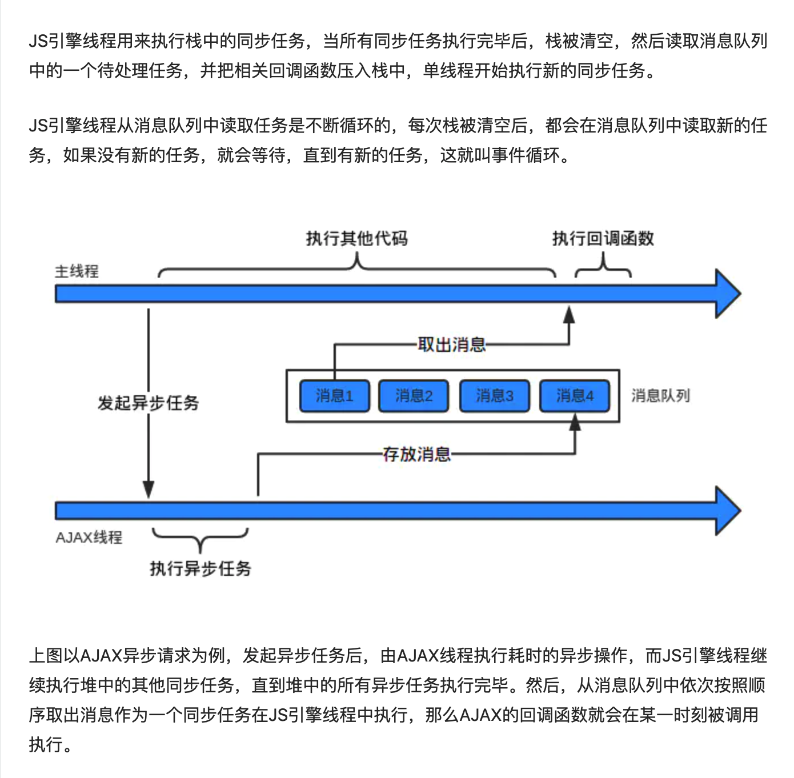

# Event Loop事件循环
## event loop 执行顺序
```$xslt
一开始整个脚本作为一个宏任务执行

执行过程中同步代码直接执行，宏任务进入宏任务队列，微任务进入微任务队列

当前宏任务执行完出队，检查微任务列表，有则依次执行，直到全部执行完成

执行浏览器UI线程的渲染工作

检查是否有web worker任务，有则执行

执行完本轮的宏任务，回到2，依次循环，直到宏任务和微任务队列都为空
```
示意图：

## 补充
>宏任务（Macrotasks）<br>
script、setTimeout、setInterval、setImmediate、I/O、UI rendering

>微任务（Microtasks）<br>
先进先出的队列，由指定的任务源去提供任务，不同的是一个event loop 里只有microtask队列<br>
MutationObserver、Object.observe、promises、process.nextTick
## 事例
### 代码运行事例
```js
Promise.resolve().then(function promise1 () {
    console.log('promise1');
})
setTimeout(function setTimeout1 (){
    console.log('setTimeout1')
    Promise.resolve().then(function  promise2 () {
        console.log('promise2');
    })
}, 0)
setTimeout(function setTimeout2 (){
    console.log('setTimeout2')
}, 0)


// 运行结果 promise1、setTimeout1、promise2、 setTimeout2
```
### 运行过程分析
```$xslt
宗旨：先执行同步任务 后执行异步任务 异步任务放到异步任务队列中

Promise.resolve() 为微任务 -> 即 加入到微任务队列
setTimeout 为 宏任务 -> 即 加入到宏任务队列
setTimeout 为 宏任务 -> 即 加入到宏任务队列
没有同步任务 执行异步任务 先执行微任务 后执行宏任务 ---> 每次执行完宏任务都要看下微任务队列中是否有任务要执行 有的话先执行微任务
即 先输出promise1 没有微任务了 执行宏任务 输出setTimeout1  遇到 Promise.resolve() 放到微任务队列
在看微任务队列中是否有微任务 输出 promise2 后在执行宏任务 输出setTimeout2
```

## 参考文档
* [JavaScript异步机制详解](https://juejin.im/post/5a6ad46ef265da3e513352c8)
* [微任务、宏任务与Event-Loop](https://juejin.cn/post/6844903657264136200)
