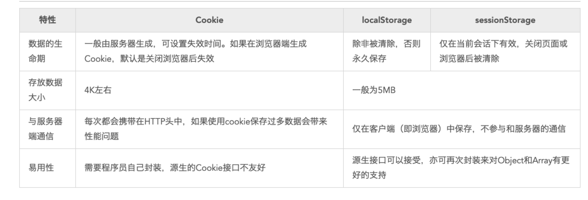

# localStorage和sessionStorage和cookie
## 概述
前端开发的时候，在网页刷新的时候，所有数据都会被清空，这时候就要用到本地存储的技术，前端本地存储的方式有三种，分别是cookie、localStorage和sessionStorage



## cookie
1、保存cookie值：
```js
let dataCookie = '110'
document.cookie = 'token' + "=" +dataCookie; 
```
2、获取指定名称的cookie值
```js
function getCookie(name) { // 获取指定名称的cookie值
  let arr = document.cookie.match(new RegExp("(^| )"+name+"=([^;]*)(;|$)"))
  if (arr != null) {
    return unescape(arr[2])
  }
  return null
}
let cookieData = getCookie('token'); // cookie赋值给变量。

```

## localStorage
```$xslt
```
## sessionStorage
```$xslt
```

