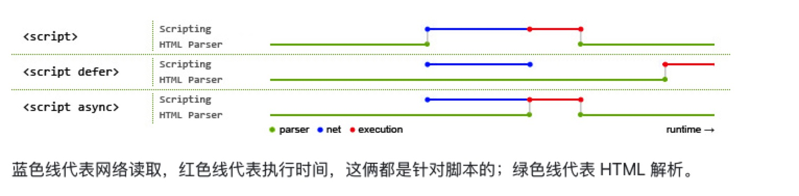

# 异步加载js的方式

```
默认情况下JavaScript是同步加载的，也就是JavaScript的加载时阻塞的，后面的元素要等待JavaScript加载完毕后才能进行再加载，对于一些意义不是很大的JavaScript，
如果放在页头会导致加载很慢的话，是会严重影响用户体验的
```

## defer --- 只支持IE
有defer，加载后续文档元素的过程将和script.js的加载并行进行---异步，但是script.js的执行要在所有元素解析完成之后，DOMContentLoaded 事件触发之前完成

## async
有async，加载和渲染后续文档的过程将和script.js的加载与执行并行进行---异步

## 区别


1、defer与async在网络读取（下载）这块是一样的，都是异步的（相较于HTML解析）
2、区别在于脚本下载之后何时执行，显然defer是最接近我们对于应用脚本加载和执行的要求的
3、async是乱序执行的，加载完了就会立刻执行，谁先加载完就先执行谁


## 补充
```
DOMContentLoaded —— 浏览器已完全加载 HTML，并构建了 DOM 树，但像  和样式表之类的外部资源可能尚未加载完成。
load —— 浏览器不仅加载完成了 HTML，还加载完成了所有外部资源：图片，样式等。
beforeunload/unload —— 当用户正在离开页面时。
```

## 参考文档
* [异步加载js的几种方式](https://www.jianshu.com/p/aeef061daab3)
* [defer和async的区别](https://segmentfault.com/q/1010000000640869)
* [页面生命周期](https://zh.javascript.info/onload-ondomcontentloaded)
