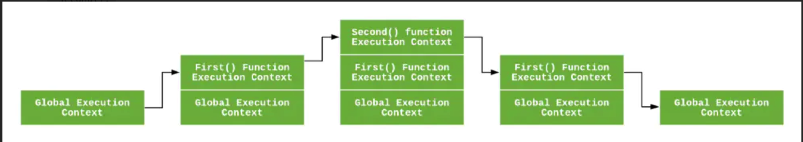

# 理解JavaScript中的执行上下文和执行栈
## 什么是执行上下文
执行上下文是JavaScript代码被解析和执行所在环境的抽象概念，每当JavaScript代码在运行的时候，它都是在执行上下文中运行

### 执行上下文的类型
JavaScript中有三种执行上下文类型<br>

* 全局执行上下文
>这是默认或者基础的上下文，任何不在函数内部的代码都在全局上下文中。<br>
它会执行两件事：创建一个全局的window对象（浏览器情况下），并且设置this的值等于这个全局对象。一个程序中只会有一个全局执行上下文。

* 函数执行上下文
>每当一个函数被调用时，都会为该函数创建一个新的上下文。<br>
每个函数都有它自己的执行上下文，不过是在函数被调用时创建。函数上下文可以有任意多个。每当一个新的执行上下文被创建，它会按定义的顺序执行一系列步骤。

* Eval函数执行上下文
>执行在eval函数内部的代码也会有它属于自己的执行上下文。

### 执行栈
执行栈也就是在其他编程语言中所说的"调用栈"，是一种拥有LIFO(后进先出)数据结构的栈，被用来存储代码运行时创建的所有执行上下文。

当JavaScript引擎第一次遇到你的脚本时，它会创建一个全局的执行上下文并且压入当前执行栈。每当引擎遇到一个函数调用，
它会为该函数创建一个新的执行上下文并压入栈的顶部。

引擎会执行那些执行上下文位于栈顶的函数，当该函数执行结束时，执行上下文从栈中弹出，控制流程到达当前栈中的下一个上下文。

```js
let a = 'Hello World!';

function first() {
  console.log('Inside first function');
  second();
  console.log('Again inside first function');
}

function second() {
  console.log('Inside second function');
}

first();
console.log('Inside Global Execution Context');
```



上述代码的执行上下文栈

* 过程分析

当上述代码在浏览器加载时，JavaScript引擎创建了一个全局执行上下文并把它压入当前执行栈。当遇到first()函数调用时，JavaScript引擎为该函数创建一个
新的执行上下文并把它压入当前执行栈的顶部。

当从first()函数内部调用second()函数时，JavaScript引擎为second()函数创建了一个新的执行上下文并把它压入当前执行栈的顶部，当second()函数执行完毕，它的执行上下文会
从当前栈弹出，并且控制流程到达下一个执行上下文，即first()函数的执行上下文。

当first()执行完毕，它的执行上下文从栈弹出， 控制流程到达全局执行上下文。一旦所有代码执行完毕，JavaScript引擎从当前栈中移除全局执行上下文。


### 怎么创建执行上下文
>创建执行上下文有两个阶段：<br>
1、创建阶段
2、执行阶段

#### 创建阶段
在JavaScript代码执行前，执行上下文将经历创建阶段。在创建阶段会发生三件事：<br>
1、this值的决定，即我们所熟悉的this绑定<br>
2、创建词法环境组件<br>
3、创建变量环境组件<br>

所以执行上下文在概念上表示如下：

```$xslt
ExecutionContext = {
  ThisBinding = <this value>,
  LexicalEnvironment = { ... },
  VariableEnvironment = { ... },
}
```

* this绑定

在全局执行上下文中，this的值指向全局对象（在浏览器中this引用window对象），


#### 执行阶段


## 参考文档
* [JavaScript 执行上下文和执行栈](https://juejin.cn/post/6844903891490832391)
* [理解 JavaScript 中的执行上下文和执行栈](https://juejin.cn/post/6844903682283143181)
