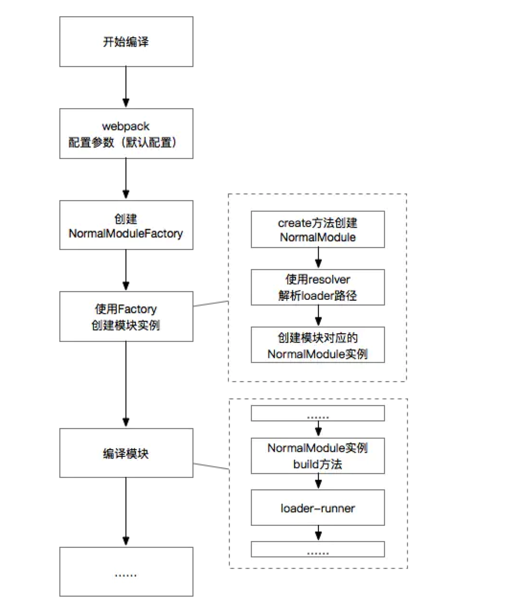

# loader
## 概述
webpack本身只能处理javascript模块，如果要处理其他类型的文件，就需要loader进行转换。

loader可以理解为模块和资源的转换器，即预处理器，让webpack处理非js文件（scss转css等等）

## 目标
* 识别出应该被loader转化的文件，使用test属性
* 转换文件，使他们加到依赖图中，最终添加到bundle中，使用use属性

## 配置
Loader可以在webpack.config.js里配置，这也是推荐的做法，定义在module.rules里

```js
// webpack.config.js
module.exports = {
    module: {
        rules: [
            {test: /\.js$/, use: 'babel-loader'},
            {
                test: /\.css$/,
                use: [
                    {loader: 'style-loader'},
                    {loader: 'css-loader'},
                    {loader: 'postcss-loader'},
                ]
            }
        ]
    }
}
```

每一条rule会包含两个属性：test和use，比如{test: /\.js$/, use: 'babel-loader'}意思就是：
当webpack遇到扩展名为js的文件时，先用babel-loader处理一下，然后在打包它

test：通过扩展名称和正则表达式来匹配资源文件

use的类型：string | array | object | function
1、string: 只有一个loader时，直接声明Loader，比如babel-loader<br>
2、array：声明多个Loader时，使用数组形式声明，比如上面处理css文件<br>
3、object：只有一个Loader时，需要有额外的配置项时<br>
4、function：use也支持回调函数的形式

注意当use是通过数组形式声明loader时，loader的执行顺序是从右到左边，从下到上，比如上面的例子就是先执行postcss-loader、css-loader、style-loader

其实就是 styleLoader(cssLoader(postcssLoader(content)))


* 所有的loader都可以配置以下项目
>test: 用来对文件名进行匹配测试，推荐使用正则表达式<br>
exclude： 被排除的文件名<br>
include: 包含的文件名<br>
loader: 逗号分割的loaders<br>
loaders: loader数组<br>

* 最佳实践
```$xlst
只有在test和文件名匹配中使用正则表达式，在include和exclude中使用绝对路径数组，避免exclude，更倾向于使用include
```

### 样式相关的loader配置
style-loader => 将css样式以style的方式加载到脚本文件中，样式起作用<br>
css-loader => css文件可以直接作为模块加载到其他脚本文件中<br>
postcss-loader => 兼容性，加厂商前缀，需要一个配置文件postcss.config.js<br>
less-loader / sass-loader / babel-loader ...

* 执行顺序：less-loader ->  postcss-loader -> css-loader -> style-loader

### 图片相关的loader配置
file-loader => 文件加载器，url或其他文件，图片较大时的图片文件<br>
url-loader => 将指定格式的文件，转为base64格式图片，一般用于重复性小图标，可以指定在文件大小小于限制时，返回DataURL

* url-loader可以设置将资源大小小于10K的资源转换为base64，即limit设置很重要，超过限制会将图片拷贝到dist文件中，将资源转换为base64，可以减少网络请求，
但base64数据大，会导致加载变慢

### loader执行顺序
loader是从右向左的取值/执行

```$xslt
// 例处理css文件

{
  test: /\.css$/,
  use: [
    {
      loader: 'style-loader'
    }, {
      loader: 'css-loader',
      options: {
        modules: true
      }
    }, {
      loader: 'sass-loader'
    }
  }]
}

loader处理顺序：sass-loader postcss-loader css-loader style-loader
```

## loader工作流程
loader的一些特点
>loader是一个node模块；<br>
loader可以处理任意类型的文件。转换成webpack可以处理的模块；<br>
loader可以在webpack.config.js里配置，也可以在require语句里内联；<br>
loader可以根据配置从右向左链式执行；<br>
loader接受源文件内容字符串或者Buffer<br>
loader分为多种类型：同步、异步和pitching，他们的执行流程不一样；<br>
webpack为loader提供了一个上下文，有一些api可以使用

webpack编译流程非常复杂，但其中涉及loader的部分主要包括了：
* loader（webpack）的默认配置
* 使用loaderResolver解析loader模块路径
* 根据rule.modules创建RulesSet规则集
* 使用loader-runner运行loader

其对应的大致流程如下：



首先，在Compiler.js中会为将用户配置与默认配置合并，其中就包括了loader部分。

然后，webpack就会根据配置创建两个关键的对象---NormalModuleFactory 和 ContextModuleFactory。它们相当于是两个类工厂，通过其可以创建相应的NormalModule 和 ContextModule。
webpack会为源码中的模块文件对应生成一个NormalModule实例

在工厂创建NormalModule实例之前还有一些必要步骤，其中与loader最相关的就是通过loader的resolve来解析loader路径

在NormalModule实例创建之后，则会通过其.bind()方法来进行模块的构建，构建模块的第一步就是使用loader来加载并处理模块内容，而loader-runner这个库就是webpack中loader的运行器

最后，将loader处理完的模块内容输出，进入后续的编译流程

## loader运行部分的具体分析
### webpack默认配置
webpack和其他工具一样，都是通过配置的方式来工作的。随着webpack的不断进化，其默认配置也在不断变动，而曾经版本中的某些最佳实践，也随着版本的升级进入了webpack的默认配置

webpack的入口文件是lib/webpack.js，会根据配置文件，设置编译时的配置options

```js
options = new WebpackOptionsDefaulter().process(options);
compiler = new Compiler(options.context);
compiler.options = options;
```

由此可见，默认配置是放在WebpackOptionsDefaulter里的，因此，如果你想要查看当前webpack默认配置项具体内容，可以在该模块里查看。

例如，在module.rules这部分的默认值为[]；但是此外还有一个module.defaultRules配置项，虽然不开放给开发者使用，但是包含了loader的默认配置 (source code)：

```js
this.set("module.rules", []);
this.set("module.defaultRules", "make", options => [
    {
        type: "javascript/auto",
        resolve: {}
    },
    {
        test: /\.mjs$/i,
        type: "javascript/esm",
        resolve: {
            mainFields:
                options.target === "web" ||
                options.target === "webworker" ||
                options.target === "electron-renderer"
                    ? ["browser", "main"]
                    : ["main"]
        }
    },
    {
        test: /\.json$/i,
        type: "json"
    },
    {
        test: /\.wasm$/i,
        type: "webassembly/experimental"
    }
]);
```

### 创建NormalModuleFactory

NormalModule是webpack中不得不提的一个类函数。源码中的模块在编译过程中会生成对应的NormalModule实例。

NormalModuleFactory是NormalModule的工厂类。其创建是在Compiler.js中进行的，Compiler.js是webpack基本编译流程的控制类

### 解析（resolve）loader的真实绝对路径

```
问题：webpack中有一个resolve的概念，用于解析模块文件的真实绝对路径，那么loader模块与normal module(源码模块)的resolve使用的是同一个么？
```

在NormalModuleFactory中，创建出NormalModule实例之前会涉及到四个钩子：

* beforeResolve <br>
* resolve <br>
* factory <br>
* afterResolve <br>

其中较为重要的有两个：
* resolve部分负责解析loader模块的路径（例如css-loader，这个loader的模块路径是什么）<br>
* factory负责来基于resolve钩子的返回值来创建NormalModule实例 <br>

resolve钩子上注册的方法较长，其中还包括了模块资源本身的路径解析。resolve有两种，分别是loaderResolver 和 normalResolver

```js
const loaderResolver = this.getResolver("loader");
const normalResolver = this.getResolver("normal", data.resolveOptions);
```

由于除了config文件中可以配置loader外，还有inline loader的写法，因此，对loader文件的路径解析也分为两种：inline loader 和 config文件中的loader。
resolve钩子中会先处理inline loader

#### inline loader

import Styles from 'style-loader!css-loader?modules!./styles.css';


