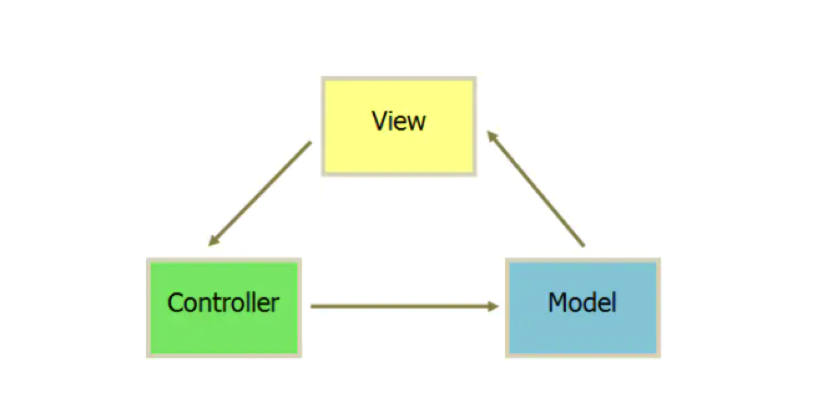

# MVVM和MVC的区别
## MVC
MVC是应用最广泛的软件架构之一，一般MVC分为Model(模型)、View(视图)、Controller(控制器)。这主要是基于分层的目的，
让彼此的职责分开，View一般用过Controller来和Model进行联系。Controller是Model和View的协调者，View和Model不直接联系，
基本都是单向联系。

* View：传送指令到Controller

* Controller：完成业务逻辑后改变Model状态

* Model：将新的数据发送至View，用户得到反馈

## MVVM
MVVM是把MVC中的Controller改变成了ViewModel

View的变化会自动更新到ViewModel，ViewModel的变化也会自动同步到View上显示，通过数据来显示视图层

## 参考文档

* [面试必问“MVVM模式及与MVP和MVC的区别”的标准答案](https://zhuanlan.zhihu.com/p/87752772)
* [MVVM与MVC设计模式区别...](https://juejin.cn/post/6844903854782283790)

