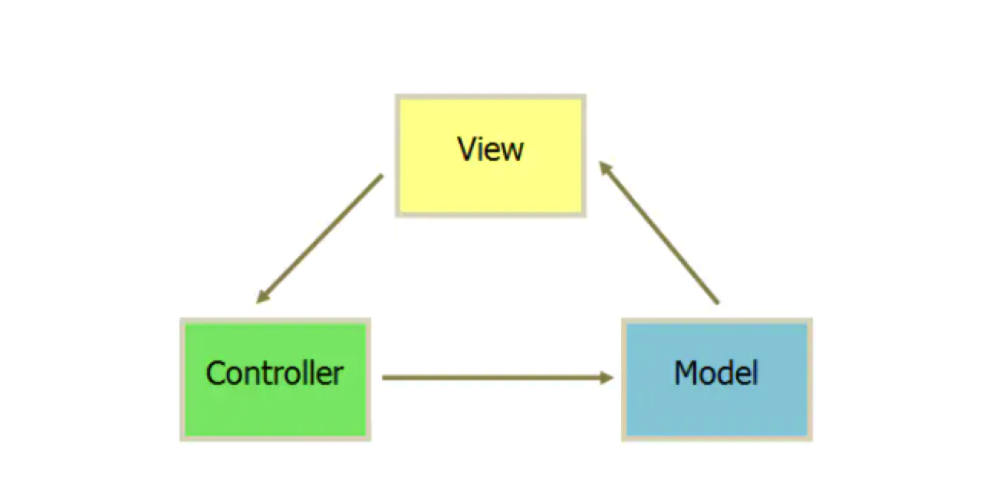
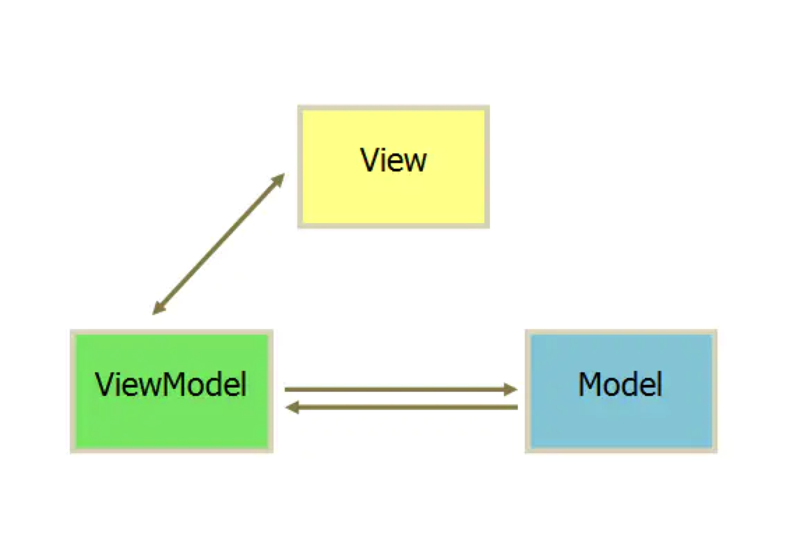

# MVVM和MVC的区别
## MVC
MVC是应用最广泛的软件架构之一，一般MVC分为Model(模型)、View(视图)、Controller(控制器)。这主要是基于分层的目的，
让彼此的职责分开，View一般用过Controller来和Model进行联系。Controller是Model和View的协调者，View和Model不直接联系，
基本都是单向联系。

View：传送指令到Controller，对应于布局文件

Controller：完成业务逻辑后改变Model状态，业务逻辑和实体模型

Model：将新的数据发送至View，用户得到反馈，对应于Activity

### 优点
>1、把业务逻辑全部分离到Controller中，模块化程度高。当业务逻辑变更的时候，不需要变更View和Model，只需要Controller换成另外一个Controller就行 
2、观察者模式可以做到多视图同时更新。

### 缺点
>1、Controller测试困难，因为视图同步操作是由View自己执行，而View只能在有UI的环境下运行，在没有UI环境下对Controller进行单元测试的时候，
Controller业务逻辑的正确性是无法验证的：Controller更新Model的时候，无法对View的更新操作进行断言 
2、View无法组件化，View是强依赖特定的Model的，如果需要把这个View抽出来作为另外一个应用程序可复用的组件就困难，因为不同程序的Domain Model是不一样的

## MVVM
MVVM是把MVC中的Controller改变成了ViewModel

View的变化会自动更新到ViewModel，ViewModel的变化也会自动同步到View上显示，通过数据来显示视图层

* 优点

低耦合：View可以独立于Model变化和修改，一个ViewModel可以绑定到不同的View上，当View变化的时候Model可以不变，当Model变化的时候View也可以不变。

可重用性：可以把一些视图逻辑放在一个ViewModel里面，让很多View重用这段视图逻辑。

独立开发：开发人员可以专注于业务逻辑和数据的开发，设计人员可以专注于页面的设计。

## 参考文档

* [面试必问“MVVM模式及与MVP和MVC的区别”的标准答案](https://zhuanlan.zhihu.com/p/87752772)
* [MVVM与MVC设计模式区别...](https://juejin.cn/post/6844903854782283790)
* [不好意思！耽误你的十分钟，让MVVM原理还给你](https://juejin.cn/post/6844903586103558158)

