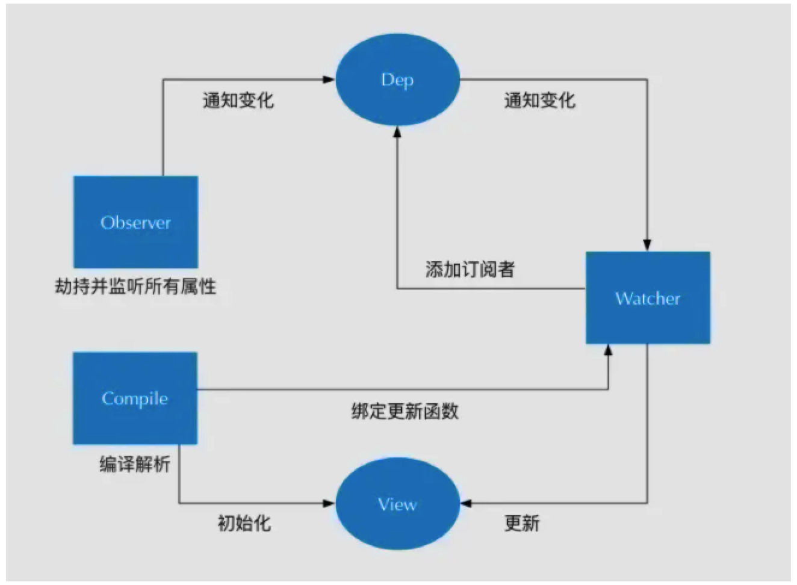

# MVVM原理
## 概述
MVVM双向数据绑定在Angular1.x版本的时候通过的是脏值检测来处理实现的，而现在无论是React还是Vue还是最新的Angular，其实实现方式都更相近了，
那就是通过数据劫持+发布订阅模式。

而真正实现其实靠的也是ES5中提供的Object.defineProperty

## Object.defineProperty用法

含义：会直接在一个对象上定义一个[新属性]或者修改一个对象的[现有属性]，并返回该对象

注意：应当直接在Object构造器对象上调用此方法，而不是在任意一个Object类型的实例上调用

```js
let obj = {};
let song = '发如雪'; 
obj.singer = '周杰伦';  

Object.defineProperty(obj, 'music', {
    // value: '七里香', // 1. music的值
    configurable: true, // 2. 可以配置对象，删除属性
    // writable: true, // 3. 可以修改对象
    enumerable: true, // 4. 可以枚举
    // get,set设置时不能设置writable和value，它们代替了二者且是互斥的
    get() {     // 5. 获取obj.music的时候就会调用get方法
        return song;
    },
    set(val) {      // 6. 将修改的值重新赋给song
        song = val;   
    }
});

// 下面打印的部分分别是对应代码写入顺序执行
console.log(obj); // {singer: '周杰伦', music: '七里香'}  // 1

delete obj.music; // 如果想对obj里的属性进行删除，configurable要设为true  2
console.log(obj); // 此时为  {singer: '周杰伦'}

obj.music = '听妈妈的话';   // 如果想对obj的属性进行修改，writable要设为true  3
console.log(obj); // {singer: '周杰伦', music: "听妈妈的话"}

for (let key in obj) {    
  // 默认情况下通过defineProperty定义的属性是不能被枚举(遍历)的
  // 需要设置enumerable为true才可以
  // 不然你是拿不到music这个属性的，你只能拿到singer
  console.log(key); // singer, music    4
}

console.log(obj.music); // '发如雪'  5
obj.music = '夜曲'; // 调用set设置新的值
console.log(obj.music); // '夜曲'    6

```

## 打造MVVM

```js
// 创建一个MVVM构造函数
// 这里用es6方法将options赋一个初始值，防止没传值，等同于options || {}

function Mvvm(options = {}) {
   // vm.$options Vue上是将所有属性挂载到上面
   // 所以我们也同样实现,将所有属性挂载到了$options
   this.$options = options;
   // this._data 这里也和Vue一样
   let data = this._data = this.$options.data;
    
   // 数据劫持
   observe(data);   
}
```

## 数据劫持
为什么要做数据劫持？

* 观察对象，给对象增加Object.defineProperty
* vue特点是不能新增不存在的属性 不存在的属性没有get和set
* 深度响应，因为每次赋予一个新对象时会给这个新对象增加defineProperty(数据劫持)

总的来说，数据劫持就是通过使用Object.defineProperty方法给对象增加get 和 set，通过set和get方法，我们可以感知数据变化，监听数据的变化。

```js
// 创建一个Observe构造函数
// 写数据劫持的主要逻辑
function Observe(data) {
    // 所谓数据劫持就是给对象增加get,set
    // 先遍历一遍对象再说
    for (let key in data) {     // 把data属性通过defineProperty的方式定义属性
        let val = data[key];
        observe(val);   // 递归继续向下找，实现深度的数据劫持
        Object.defineProperty(data, key, {
            configurable: true,
            get() {
                return val;
            },
            set(newVal) {   // 更改值的时候
                if (val === newVal) {   // 设置的值和以前值一样就不理它
                    return;
                }
                val = newVal;   // 如果以后再获取值(get)的时候，将刚才设置的值再返回去
                observe(newVal);    // 当设置为新值后，也需要把新值再去定义成属性
            }
        });
    }
}

// 外面再写一个函数
// 不用每次调用都写个new
// 也方便递归调用
function observe(data) {
    // 如果不是对象的话就直接return掉
    // 防止递归溢出
    if (!data || typeof data !== 'object') return;
    return new Observe(data);
}

```

## 数据代理
数据代理就是让我们每次拿到data里面的数据时，不用每次都写一长串，如mvvm._data.a.b这种，我们其实可以直接写成mvvm.a.b这种显而易见的方式

```js
function Mvvm(option = {}) {
  // 数据劫持
  observe(data)
  // this 代理了 this._data
  for (let key in data) {
      Object.defineProperty(this, key, {
          configurable: true,
          get() {
              return this._data[key];     // 如this.a = {b: 1}
          },
          set(newVal) {
              this._data[key] = newVal;
          }
      });
  }
}

// 此时就可以简化写法了
console.log(mvvm.a.b) // 1
mvvm.a.b = 'ok'
console.log(mvvm.a.b) // 'ok'

```

## 数据编译

```js
// vue中的写法
let mvvm = new Mvvm({
    el: '#app',
    data: {     // Object.defineProperty(obj, 'song', '发如雪');
        song: '发如雪',
        album: {
            name: '十一月的萧邦',
            theme: '夜曲'
        },
        singer: '周杰伦'
    }
});

```

```js
// 原理实现

function Mvvm(options = {}) {
  // 数据劫持
  observe(data) 
  // 编译
  new Compile(options.el, this)
}


// 创造Compile构造函数
function Compile(el, vm) {
  // 将el挂载到实例上方便调用
  vm.$el = document.querySelector(el);
  // 在el范围里将内容都拿到，当然不能一个一个的拿
  // 可以选择移到内存中然后放入文档碎片中，节省开销
  let fragment = document.createDocumentFragment(); // 创建一个新的空白的文档片段
  
  while (child = vm.$el.firstChild) {
    fragment.appendChild(child); // 此时将el中的内容放入内存中
  }
  // 对el里面的内容进行替换
  function replace(frag) {
    Array.from(frag.childNodes).forEach(node => {
        let txt = node.textContent;
        let reg = /\{\{(.*?)\}\}/g;   // 正则匹配{{}}
        if (node.nodeType === 3 && reg.test(txt)) { // 即是文本节点又有大括号的情况{{}}
          console.log(RegExp.$1) // 匹配到的第一个分组 如：a.b, c
          let arr = RegExp.$1.split('.');
          let val = vm;
          arr.forEach(key => {
              val = val[key];
          })
          // 用trim方法去除一下首位空格
          node.textContent = txt.replace(reg, val).trim()
        }
        // 如果还有子节点，继续递归replace
        if (node.childNodes && node.childNodes.length) {
          replace(node)
        }
    })
  }
  
  replace(fragment); // 替换内容
  
  vm.$el.appendChild(fragment); // 再将文档碎片放入el中
}
```

现在数据已经编译了，但还没有在页面中显示出来，此处可以使用发布订阅模式

## 发布订阅模式

发布订阅模式主要跟数组关系，订阅就是放入函数，发布就是让数组里的函数执行

流程图：



```js
// 发布订阅模式 订阅和发布 如[fn1, fn2， fn3]
// 订阅器Dep实现
function Dep() {
  // 一个数组(存放函数的事件池)
  this.subs = [];
}

Dep.prototype = {
    addSub(sub) {
      this.subs.push(sub);
    },
    notify() {
      // 绑定的方法，都有一个update方法
      this.subs.forEach(sub => sub.update());
    }
};

// 监听函数
// 通过Watcher这个类创建的实例，都拥有update方法
// 订阅者实现
function Watcher(fn) {
    this.fn = fn; // 将fn放到实例上
}
Watcher.prototype.update = function() {
  this.fn();
}

let watcher = new Watcher(() => console.log(111));
let dep = new Dep();
dep.addSub(watcher); // 将Watcher放到数组中，watcher自带update方法， => [watcher]
dep.addSub(watcher);
dep.notify(); // 111, 

```

## 数据更新视图
* 现在我们要订阅一个事件，当数据改变需要重新刷新视图，这就需要在replace替换的逻辑里来处理<br>

* 通过new Watcher把数据订阅一下，数据一变就执行改变内容的操作

```js
function replace(frag) {
  // 省略
  // 替换的逻辑
  next.textContent = txt.replace(reg, val).trim();
  // 监听变化
  // 给Watcher在添加两个参数，用来取新的值（newVal）给回调函数传参数
  new Watcher(vm, RegExp.$1, newVal => {
      node.textContent = txt.replace(reg, newVal).trim();
  })
}

// 重写Watcher构造函数
function Watcher(vm, exp, fn) {
  this.fn = fn;
  this.vm = vm;
  this.exp = exp;
  // 添加一个事件
  // 这里我们先定义一个属性
  Dep.target = this;
  let arr = exp.split('.')
  let val = vm;
  arr.forEach(key => { // 取值
      val = val[key]; // 获取到this.a.b, 默认就会调用get方法
  });
  Dep.target = null;
}
```

当获取值的时候就会自动调用get方法，于是我们去找一下数据劫持那里的get方法

```js
function Observe(data) {
  let dep = new Dep();
  // 省略
  Object.defineProperty(data, key, {
    get() {
      Dep.target && dep.addSub(Dep.target); // 将watcher添加到订阅事件中[watcher]
      return val
    },
    set(newVal) {
      if (val === newVal) {
        return;
      }
      val = newVal;
      observe(newVal);
      dep.notify(); // 让所有watcher的update方法执行即可
    }
  })
}
```

当set修改值的时候执行了dep.notify()方法，这个方法是执行watcher的update方法，那么我们再对update进行修改一下

```js
Watcher.prototype.update = function() {
  // notify的时候值已经更改了
  // 再通知vm，exp来获取新的值
  let arr = this.exp.split('.')
  let val = this.vm
  arr.forEach(key => {
      val = val[key]; // 通过get获取到新的值
  });
  this.fn(val); // 将每次拿到的新值去替换{{}}的内容即可
}
```

现在我们数据的更改可以修改视图了，最后就是数据的双向绑定了


