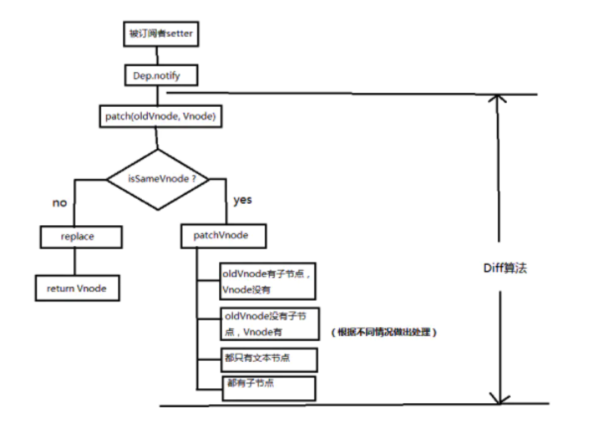
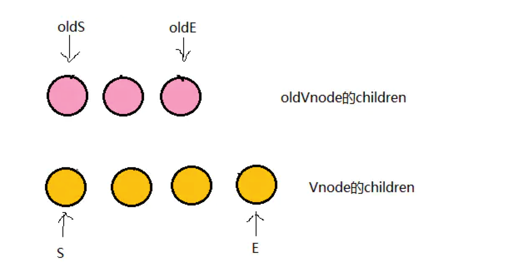

# 详解Vue的diff算法
## 当数据发生变化时，Vue是怎么更新Dom节点的？
要知道渲染真实Dom的开销是很大的，比如有时候我们修改了某个数据，如果直接渲染到真实的Dom上会引起整个Dom树的重排和重绘，
有没有可能我们更新数据的时候，只更新我们修改的那一小块Dom而不要更新整个Dom呢？

方式：
>我们先根据真实DOM生成一颗virtual DOM，当virtual DOM某个节点的数据改变后会生成一个新的Vnode，然后Vnode和oldVnode作对比，
发现有不一样的地方就直接修改在真实的DOM上，然后使oldVnode的值为Vnode。

## 虚拟Dom和真是Dom的区别是什么？
虚拟Dom是将真实的Dom的数据抽取出来，以对象的形式模拟树形结构

```html
<div>
    <p>123</p>
</div>
```
对应的virtual DOM（伪代码）：
```js
var Vnode = {
    tag: 'div',
    children: [
        { tag: 'p', text: '123' }
    ]
};
```

## diff的比较方式？
在采用diff算法比较新旧节点的时候，比较只会在同层级进行，不会跨层级比较

```html
<div>
    <p>123</p>
</div>

<div>
    <span>456</span>
</div>
```
上面的代码会分别比较同一层的两个div以及第二层的p和span，但是不会拿div和span作比较，只会在同一层级进行比较

## diff流程图
总体：当数据发生改变时，set方法会调用Dep.notify通知所有订阅者Watcher，订阅者就会调用patch给真实的DOM打补丁，更新相应的视图



## 流程分析
### patch
来看看patch是怎么打补丁的（代码核心部分）

```js
function patch (oldVnode, vnode) {
    // some code
    if (sameVnode(oldVnode, vnode)) {
    	patchVnode(oldVnode, vnode)
    } else {
    	const oEl = oldVnode.el // 当前oldVnode对应的真实元素节点
    	let parentEle = api.parentNode(oEl)  // 父元素
    	createEle(vnode)  // 根据Vnode生成新元素
    	if (parentEle !== null) {
            api.insertBefore(parentEle, vnode.el, api.nextSibling(oEl)) // 将新元素添加进父元素
            api.removeChild(parentEle, oldVnode.el)  // 移除以前的旧元素节点
            oldVnode = null
    	}
    }
    // some code 
    return vnode
}

function sameVnode (a, b) {
  return (
    a.key === b.key &&  // key值
    a.tag === b.tag &&  // 标签名
    a.isComment === b.isComment &&  // 是否为注释节点
    // 是否都定义了data，data包含一些具体信息，例如onclick , style
    isDef(a.data) === isDef(b.data) &&  
    sameInputType(a, b) // 当标签是<input>的时候，type必须相同
  )
}
```

patch函数接收两个参数oldVnode和Vnode分别代表之前的旧节点和新的节点<br>
判断两节点是否值得比较，值得比较则执行patchVnode方法，不值得比较则用Vnode替换oldVnode

如果两个节点都是一样的，那么就深入检查它们的子节点，如果两个节点不一样那就说明Vnode完全被改变了，就可以直接替换oldVnode

### patchVnode
当我们确定两个节点值得比较之后我们会对两个节点指定patchVnode方法，
```js
patchVnode (oldVnode, vnode) {
    const el = vnode.el = oldVnode.el
    let i, oldCh = oldVnode.children, ch = vnode.children
    if (oldVnode === vnode) return
    if (oldVnode.text !== null && vnode.text !== null && oldVnode.text !== vnode.text) {
        api.setTextContent(el, vnode.text)
    }else {
        updateEle(el, vnode, oldVnode)
    	if (oldCh && ch && oldCh !== ch) {
            updateChildren(el, oldCh, ch)
    	}else if (ch){
            createEle(vnode) //create el's children dom
    	}else if (oldCh){
            api.removeChildren(el)
    	}
    }
}
```

这个函数做了以下事情：
>1、找到对应的真实Dom，称为el<br>
2、判断Vnode和oldVnode是否指向同一个对象，如果是，那么直接return<br>
3、如果他们都有文本节点并且不相等，那么将el的文本节点设置为Vnode的文本节点<br>
4、如果oldVnode有子节点而Vnode没有，则删除el的子节点<br>
5、如果oldVnode没有子节点而Vnode有，则将Vnode的子节点真实化之后添加到el<br>
6、如果两者都有子节点，则执行updateChildren函数比较子节点<br>

### updateChildren
功能作用

* 将Vnode的子节点Vch和oldVnode的子节点oldCh提取出来

* oldCh和vCh各有两个头尾的变量StartIdx和EndIdx，它们的两个变量相互比较，一共有4种比较方式。
如果4种比较都没匹配，如果设置了key，就会用key进行比较，在比较的过程中，变量会往中间靠，一旦StartIdx>EndIdx表明oldCh和vCh至少有一个已经遍历完了，就会结束比较。



现在分别对oldS、oldE、S、E两两做sameVnode比较，有四种比较方式，当其中两个能匹配上那么真实dom中的相应节点会移到Vnode相应的位置

1、如果是oldS和E匹配上了，那么真实dom中的第一个节点会移到最后

2、如果oldE和S匹配上了，那么真实dom中的最后一个节点会移到最前，匹配上的两个指针向中间移动

3、如果这四种匹配没有一对是成功的，分为两种情况

>1、如果新旧子节点都存在key，那么会根据oldChild的key生成一张hash表，用S的key与hash表做匹配，匹配成功就判断S和匹配节点是否为sameNode，
如果是，就在真实dom中将成功的节点移到最前面，否则，将S生成对应的节点插入到dom中对应的oldS位置，S指针向中间移动，被匹配old中的节点置为null<br>
2、如果没有key，则直接将S生成新的节点插入真实dom（ps：解释为什么v-for的时候需要设置key了，如果没有key那么就只会做四种匹配，就算指针中间有可复用的节点都不能被复用了）
    
    

## 参考文档

* [详解vue的diff算法](https://juejin.cn/post/6844903607913938951)
* [VDom&diff算法](https://github.com/answershuto/learnVue/blob/master/docs/VirtualDOM%E4%B8%8Ediff(Vue%E5%AE%9E%E7%8E%B0).MarkDown)


