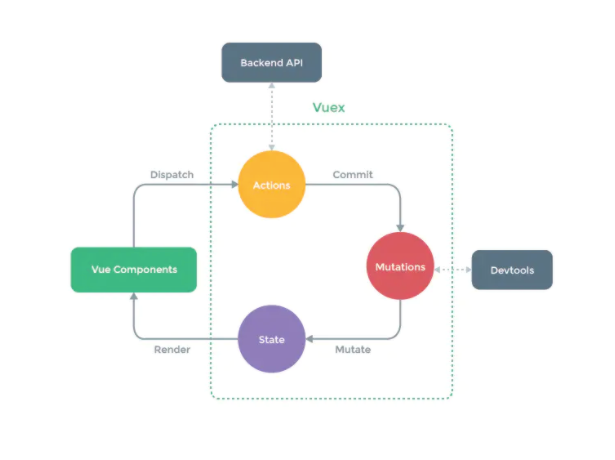

# vuex
## 概览
组件化应用构建是Vue的特点之一，因此我们在Vue的实际开发过程中会经常需要封装自定义组件，以提高开发的效率。
而组件在大部分情况下并不会孤立的存在，它必然会与父组件和兄弟组件产生数据的交互

## 介绍
Vuex是一个专为Vue.js应用程序开发的状态管理模式，它采用集中式存储管理应用的所有组件的状态，并以相应的规则保证状态以一种可预测的方式发生变化

简单来说，Vuex就是一种公共的状态管理器，可以管理所有组件的状态



state是存储公共的状态，组件需要访问state数据时通过this.$store.state.属性 进行访问，修改了state页面会自动更新

actions是用来处理异步数据（当Vuex中的数据需要通过异步获取时，就必须要在actions中进行配置）

mutations是用来修改state中的数据，注意state中的数据只能在mutations里面的每一个函数中，通过默认传递的state参数进行修改

getters可以理解为是store的计算属性，getters中的函数依赖于state中的属性，当state中的属性发生了改变就会触发getters里面的方法

然后在src文件目录下新建一个名为store的文件夹，为方便引入并在store文件夹里新建一个index.js
```js
import Vue from 'vue'
import Vuex from 'vuex'
Vue.use(Vuex);
const store = new Vuex.Store();

export default store;
```

接下来，在main.js里面引入store，然后在全局注入一下，这样一来就可以在任何一个组件里面使用this.$store
```js
import store from './store' // 引入store

new Vue({
    el: '#app',
    router,
    store,
    template: '<App/>',
    components: {App}
})
```

回到store文件的index.js里面，我们先声明一个state变量，并赋值一个空对象给它，里面定义初始属性值，然后再在实例化的Vuex.Store里面传入一个空对象，并把刚声明的变量state放里面

```js
import Vue from 'vue';
import Vuex from 'vuex';
Vue.use(Vuex);
const state={//要设置的全局访问的state对象
    showFooter: true,
    changableNum: 0
    //要设置的初始属性值
};
const store = new Vuex.Store({
  state
});
 
export default store;
```

实际上做完上面的三个步骤之后，你已经可以用this.$store.state.showFooter等在任何一个组件里面获取showFooter的值了，但这不是理想的获取方式，
Vuex提供了getters 和 vue计算属性computed一样，来实时监听state值得变化
