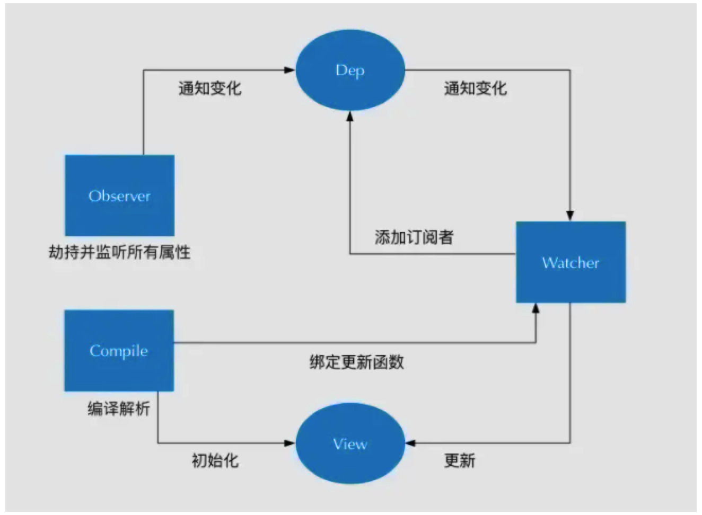

# Vue的双向绑定
## 绑定原理
vue数据双向绑定是通过数据劫持结合发布者-订阅者模式的方式来实现的

即Vue内部通过Object.defineProperty方法属性拦截的方式，把data对象里每个数据的读写转化成getter/setter，当数据变化时通知视图更新。

## 什么是MVVM数据双向绑定
MVVM数据双向绑定主要是指：数据变化更新视图，视图变化更新数据

即
* 输入框内容变化时，Data中的数据同步变化，即View => Data的变化。
* Data中数据变化时，文本节点的内容同步变化。即Data => View的变化。

其中，View变化更新Data，可以通过事件监听的方式来实现，即如何根据Data变化更新View。

### 实现数据的双向绑定
1、实现一个监听器Observer，用来劫持并监听所有属性，如果属性发生变化，就通知订阅者。 
2、实现一个订阅器Dep，用来收集订阅者，对监听器Observer和订阅者Watcher进行统一管理。 
3、实现一个订阅者Watcher，可以收到属性的变化通知并执行相应的方法，从而更新视图。 
4、实现一个解析器Compile，可以解析每个节点的相关指令，对模板数据和订阅器进行初始化。 

流程图：

## 监听器Observer实现
监听器Observer的实现，主要是指让数据对象变得"可观测"，即每次数据读或者写时，我们能感知到数据被读取了或者数据被改了。
要使数据变得"可观测"，Vue2.0源码中用到Object.defineProperty()来劫持各个数据属性的setter/getter。

>Object.defineProperty()方法会直接在一个对象上定义一个新属性，或者修改一个对象的现有属性并返回这个对象

### Object.defineProperty()语法
>Object.defineProperty(obj, prop, descriptor)

* 参数
obj: 要在其上定义属性的对象 
prop: 要定义或修改的属性的名称 
descriptor: 将被定义或修改的属性描述符 

* 返回值
被传递给函数的对象

* 属性描述符

## 订阅者Dep实现
## 订阅者Watcher实现
## 解析器Compile实现
## 源码

## 参考文档

* [vue 的双向绑定原理及实现](https://juejin.im/entry/6844903479044112391)
* [0 到 1 掌握：Vue 核心之数据双向绑定](https://juejin.im/post/6844903903822086151)

