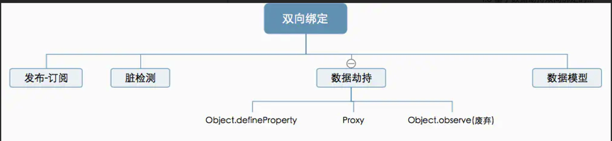
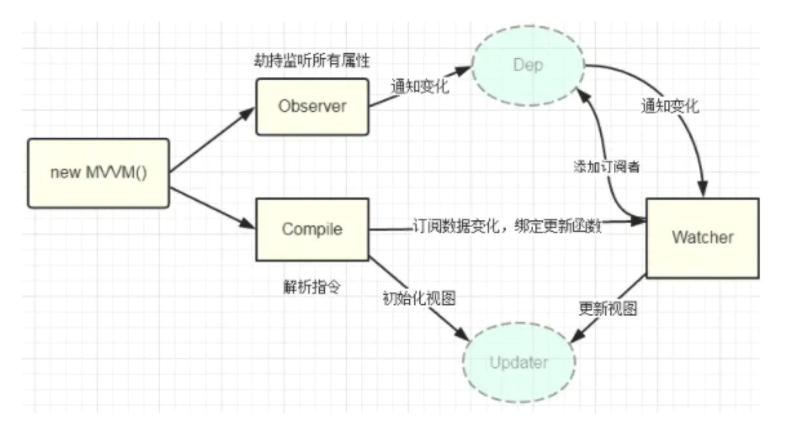

# 实现双向绑定Proxy比defineproperty优劣如何?
## 概述
Vue三要素
>响应式：例如如何监听数据变化，其中的实现方法就是我们提到的双向绑定<br>
模版引擎：如何解析模版<br>
渲染：Vue如何将监听到的数据变化和解析后的HTML进行渲染

常见的基于数据劫持的双向绑定有两种实现，一个是目前Vue在用的Object.defineProperty，另一个是ES2015中新增的Proxy，而Vue将在Vue3.0版本后加入Proxy，从而代替Object.defineProperty

>严格来讲Proxy应该被称为「代理」而非「劫持」，不过由于作用有很多相似之处，

数据绑定方式：



## 基于数据劫持实现的双向绑定的特点

### 什么是数据劫持
数据劫持比较好理解，通常我们利用 Object.defineProperty 劫持对象的访问器，在属性值发生变化时我们可以获取变化，从而进行进一步操作

```js
// 这是将要被劫持的对象
const data = {
  name: '',
};

function say(name) {
  if (name === '古天乐') {
    console.log('给大家推荐一款超好玩的游戏');
  } else if (name === '渣渣辉') {
    console.log('戏我演过很多,可游戏我只玩贪玩懒月');
  } else {
    console.log('来做我的兄弟');
  }
}

// 遍历对象,对其属性值进行劫持
Object.keys(data).forEach(function(key) {
  Object.defineProperty(data, key, {
    enumerable: true, // 可枚举
    configurable: true, // 可配置对象，删除属性
    get: function() {
      console.log('get');
    },
    set: function(newVal) {
      // 当属性值发生变化时我们可以进行额外操作
      console.log(`大家好,我系${newVal}`);
      say(newVal);
    },
  });
});

data.name = '刘德华';
//大家好,我系渣渣辉
//戏我演过很多,可游戏我只玩贪玩懒月

```

### 数据劫持的优势
目前业界分为两个大的流派，一个是以React为首的单向数据绑定，另一个是以Angular、Vue为主的双向数据绑定。

>其实三大框架都是既可以双向绑定也可以单向绑定，比如React可以手动绑定onChange和value实现双向绑定，也可以调用一些双向绑定库，Vue也加入了props这种单向流的api，不过都是非主流卖点

数据劫持的优势所在：

1、无需显示调用：例如Vue运用数据劫持+发布订阅，直接可以通知变化并驱动视图。<br>
上面的例子也是比较简单的实现data.name = '刘德华'后直接触发变更，而比如Angular的脏值检测则需要显示调用markForCheck，react需要显示调用setState

2、可精确得知变化数据：还是上面的小🌰，我们劫持了属性的setter，当属性值改变，我们可以精确获知变化的内容newVal，因此在这个部分不需要额外的diff操作，否则我们只知道数据发生了变化而不知道
具体哪些数据变化了，这个时候大量diff来找出变化值，这个额外性能损耗。

### 基于数据劫持双向绑定的实现思路
数据劫持是双向绑定各种方案中比较流行的一种，最著名的实现就是Vue

基于数据劫持的双向绑定离不开 Proxy 与 Object.defineProperty 等方法对对象/对象属性的劫持，要点：

1、利用 Proxy 或 Object.defineProperty生成的Observer针对对象/对象属性进行劫持， 在属性发生变化后通知订阅者

2、解析器 Compile 解析模版中的 Directive（指令），收集指令所依赖的方法和数据，等待数据变化然后进行渲染

3、Watcher数据 Observer 和 Compile 桥梁，它将接收到的Observer产生的数据变化，并根据Compile提供的指令进行视图渲染，使得数据变化促使视图比那话




## 基于Object.defineProperty双向数据绑定的特点
### 极简版的双向绑定
Object.defineProperty的作用就是劫持一个对象的属性，通常我们对属性的getter和setter方法进行劫持，在对象的属性发生变化时进行特定的操作

我们就对对象obj的text属性进行劫持，在获取此属性的值时打印 'get val'，在更改属性值的时候对DOM进行操作，这就是一个极简的双向绑定

```js
const obj = {};
Object.defineProperty(obj, 'text', {
  get: function() {
    console.log('get val');
  },
  set: function(newVal) {
    console.log('set val:' + newVal);
    document.getElementById('input').value = newVal;
    document.getElementById('span').innerHTML = newVal;
  }
});

const input = document.getElementById('input');
input.addEventListener('keyup', function(e){
  obj.text = e.target.value;
})
```

### 升级改造
极简版问题

1、我们只监听了一个属性，一个对象不可能只有一个属性，我们需要对对象每个属性进行监听。

2、违反开发封闭原则，我们如果了解开放封闭原则的话，上述代码是明显违反此原则，我们每次修改都需要进入方法内部，这是需要坚决杜绝的。

3、代码耦合严重，我们的数据、方法和DOM都是耦合在一起的，就是传说中的面条代码

* Vue的操作就是加入了发布订阅模式，结合Object.defineProperty的劫持能力，实现了可用性很高的双向绑定。

我们先实现一个订阅发布中心，即消息管理员（Dep），它负责储存订阅者和消息的分发，不管是订阅者还是发布者都需要依赖于它。

```js
let uid = 0;
// 用于储存订阅者并发布消息
class Dep {
    constructor() {
      // 设置id,用于区分新Watcher和只改变属性值后新产生的Watcher
      this.id = uid++;
      // 储存订阅者的数组
      this.subs = [];
    }
    // 触发target上的Watcher中的addDep方法,参数为dep的实例本身
    depend() {
      Dep.target.addDep(this);
    }
    // 添加订阅者
    addSub(sub) {
      this.subs.push(sub);
    }
    notify() {
      // 通知所有的订阅者(Watcher)，触发订阅者的相应逻辑处理
      this.subs.forEach(sub => sub.update());
    }
}
// 为Dep类设置一个静态属性,默认为null,工作时指向当前的Watcher
Dep.target = null;

```

现在我们需要实现监听者（Observer），用于监听属性值的变化 --- Observer

```js
// 监听者,监听对象属性值的变化
class Observer {
    constructor(value) {
      this.value = value;
      this.walk(value);
    }
    // 遍历属性值并监听
    walk(value) {
      Object.keys(value).forEach(key => this.convert(key, value[key]));
    }
    // 执行监听的具体方法
    convert(key, val) {
      defineReactive(this.value, key, val);
    }
}

function defineReactive(obj, key, val) {
    const dep = new Dep();
    // 给当前属性的值添加监听
    let chlidOb = observe(val);
    Object.defineProperty(obj, key, {
      enumerable: true,
      configurable: true,
      get: () => {
        // 如果Dep类存在target属性，将其添加到dep实例的subs数组中
        // target指向一个Watcher实例，每个Watcher都是一个订阅者
        // Watcher实例在实例化过程中，会读取data中的某个属性，从而触发当前get方法
        if (Dep.target) {
          dep.depend();
        }
        return val;
      },
      set: newVal => {
        if (val === newVal) return;
        val = newVal;
        // 对新值进行监听
        chlidOb = observe(newVal);
        // 通知所有订阅者，数值被改变了
        dep.notify();
      },
    });
}

function observe(value) {
// 当值不存在，或者不是复杂数据类型时，不再需要继续深入监听
    if (!value || typeof value !== 'object') {
      return;
    }
    return new Observer(value);
}
```

实现一个订阅者 --- Watcher

```js
class Watcher {
    constructor(vm, expOrFn, cb) {
      this.depIds = {}; // hash储存订阅者的id,避免重复的订阅者
      this.vm = vm; // 被订阅的数据一定来自于当前Vue实例
      this.cb = cb; // 当数据更新时想要做的事情
      this.expOrFn = expOrFn; // 被订阅的数据
      this.val = this.get(); // 维护更新之前的数据
    }
    // 对外暴露的接口，用于在订阅的数据被更新时，由订阅者管理员(Dep)调用
    update() {
      this.run();
    }
    addDep(dep) {
      // 如果在depIds的hash中没有当前的id,可以判断是新Watcher,因此可以添加到dep的数组中储存
      // 此判断是避免同id的Watcher被多次储存
      if (!this.depIds.hasOwnProperty(dep.id)) {
        dep.addSub(this);
        this.depIds[dep.id] = dep;
      }
    }
    run() {
      const val = this.get();
      console.log(val);
      if (val !== this.val) {
        this.val = val;
        this.cb.call(this.vm, val);
      }
    }
    get() {
      // 当前订阅者(Watcher)读取被订阅数据的最新更新后的值时，通知订阅者管理员收集当前订阅者
      Dep.target = this;
      const val = this.vm._data[this.expOrFn];
      // 置空，用于下一个Watcher使用
      Dep.target = null;
      return val;
    }
}
```

将上述方法挂载在Vue上

```js
class Vue {
    constructor(options = {}) {
      // 简化了$options的处理
      this.$options = options;
      // 简化了对data的处理
      let data = (this._data = this.$options.data);
      // 将所有data最外层属性代理到Vue实例上
      Object.keys(data).forEach(key => this._proxy(key));
      // 监听数据
      observe(data);
    }
    // 对外暴露调用订阅者的接口，内部主要在指令中使用订阅者
    $watch(expOrFn, cb) {
      new Watcher(this, expOrFn, cb);
    }
    _proxy(key) {
      Object.defineProperty(this, key, {
        configurable: true,
        enumerable: true,
        get: () => this._data[key],
        set: val => {
          this._data[key] = val;
        },
      });
    }
}
```

### 缺点
1、Object.defineProperty的第一个缺陷就是无法监听数组变化，然而[Vue文档](https://cn.vuejs.org/v2/guide/list.html#%E6%95%B0%E7%BB%84%E6%9B%B4%E6%96%B0%E6%A3%80%E6%B5%8B)提到了Vue是可以检测到数组变化的，但是只有以下八种方法，vm.item[indexOfItem] = newValue 这种是无法检测的

>push()<br>
pop()<br>
shift()<br>
unshift()<br>
splice()<br>
sort()<br>
reverse()

2、Object.defineProperty的第二个缺陷就是只能劫持对象的属性，因此我们需要对每个对象的每个属性进行遍历，如果属性值也是对象那么需要深度遍历，显然能劫持一个完整的对象是更好的选择


## Proxy实现的双向绑定的特点
Proxy在ES2015规范中被正式发布，它在目标对象之前架设一层'拦截'，外界对该对象的访问，都必须先通过这层拦截，因此提供了一种机制，可以对外界的访问进行过滤和改写，
我们可以这样认为，Proxy是Object.defineProperty的全方位加强版

* 优点
1、可以劫持整个对象，并返回一个新对象<br>
2、有13种劫持操作

既然Proxy能解决以上两个问题，而且Proxy作为ES6的新属性在 Vue2.x 之前就有了，为什么Vue2.x 不使用Proxy呢？

Proxy是ES6提供的新特性，兼容性不好，最主要的是这个属性无法用polyfill兼容

### Proxy可以直接监听对象而非属性

```js
const input = document.getElementById('input');
const p = document.getElementById('p');
const obj = {};

const newObj = new Proxy(obj, {
  get: function(target, key, receiver) {
    console.log(`getting ${key}!`);
    return Reflect.get(target, key, receiver);
  },
  set: function(target, key, value, receiver) {
    console.log(target, key, value, receiver);
    if (key === 'text') {
      input.value = value;
      p.innerHTML = value;
    }
    return Reflect.set(target, key, value, receiver);
  },
});

input.addEventListener('keyup', function(e) {
  newObj.text = e.target.value;
});

```
可以看到Proxy直接可以劫持整个对象，并返回一个新对象，不管是操作遍历程度还是底层功能上都远强于Object.defineProperty

### Proxy可以直接监听数组的变化
当我们对数组进行操作(push、shift、splice等)时，会触发对应的方法名称和length的变化，我们可以借此进行操作，以上述Object.defineProperty无法生效的列表渲染为例

```js
const list = document.getElementById('list');
const btn = document.getElementById('btn');

// 渲染列表
const Render = {
  // 初始化
  init: function(arr) {
    const fragment = document.createDocumentFragment();
    for (let i = 0; i < arr.length; i++) {
      const li = document.createElement('li');
      li.textContent = arr[i];
      fragment.appendChild(li);
    }
    list.appendChild(fragment);
  },
  // 我们只考虑了增加的情况,仅作为示例
  change: function(val) {
    const li = document.createElement('li');
    li.textContent = val;
    list.appendChild(li);
  },
};

// 初始数组
const arr = [1, 2, 3, 4];

// 监听数组
const newArr = new Proxy(arr, {
  get: function(target, key, receiver) {
    console.log(key);
    return Reflect.get(target, key, receiver);
  },
  set: function(target, key, value, receiver) {
    console.log(target, key, value, receiver);
    if (key !== 'length') {
      Render.change(value);
    }
    return Reflect.set(target, key, value, receiver);
  },
});

// 初始化
window.onload = function() {
    Render.init(arr);
}

// push数字
btn.addEventListener('click', function() {
  newArr.push(6);
});

```

## 参考文档

* [数组更新检测](https://cn.vuejs.org/v2/guide/list.html#%E6%95%B0%E7%BB%84%E6%9B%B4%E6%96%B0%E6%A3%80%E6%B5%8B)
* [Vue篇(004)-Vue3 为什么要用 Proxy 代替 Object.defineProperty](https://my.oschina.net/qiilee/blog/4562011)
* [面试官: 实现双向绑定Proxy比defineproperty优劣如何?](https://juejin.cn/post/6844903601416978439)

