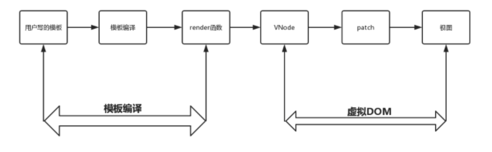

# 模板编译
## 概览
我们在开发过程中，在<template></template>标签中除了写一些原生HTML的标签，我们还会写一些变量插值或者Vue指令，而这些东西都是在原生HTML语法中不存在的，
不被接受的，但是却被正确识别和显示了，这又是为什么？

这就归功于Vue的模板编译了，Vue会把用户在<template></template>标签中写的类似于原生HTML的内容进行编译，把原生HTML的内容找出来，再把非原生HTML找出来，
经过一系列的逻辑处理生成渲染函数，也就是render函数，而render函数会将模板内容生成对应的VNode，在根据VNode创建真实的DOM节点并插入到视图中，最终完成视图的渲染更新

而把用户在<template></template>标签中写的类似于原生HTML内容进行编译，把原生HTML的内容找出来，在把非原生的HTML找出来，经过一系列的逻辑处理生成渲染函数，
也就是render函数的这一段过程称之为模板编译过程

## 整体渲染流程
所谓渲染流程，就是把用户写的类似于原生HTML的模板经过一系列处理最终反应到视图中称之为整个渲染流程

模板编译过程就是把用户写的模板经过一系列处理最终生成render函数的过程

### 模板编译内部流程
那么模板编译内部是怎么把用户写的模板经过处理最终生成render函数的呢？这内部的过程是怎么样的呢？

#### 抽象语法树
用户在<template></template>标签中写的模板对Vue来说就是一堆字符串
