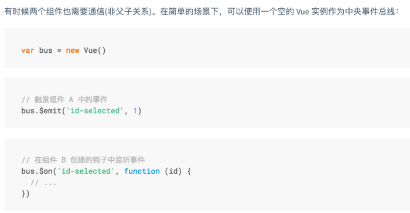

# 组件通信方式
## props/$emit
父组件通过props向子组件传递数据，而子组件通过$emit向父组件通信

* 父组件向子组件传值

```vue
<!--父组件section-->
<template>
  <div class="section">
    <com-article :articles="articleList"></com-article>
  </div>
</template>

<script>
import comArticle from 'article.vue'
export default {
  name: 'HelloWorld',
  components: { comArticle },
  data() {
    return {
      articleList: ['红楼梦', '西游记', '三国演义']
    }
  }
}
</script>

<!--子组件 article.vue-->
<template>
  <div>
    <span v-for="(item, index) in articles" :key="index">{{item}}</span>
  </div>
</template>

<script>
export default {
  props: ['articles']
}
</script>

```

>总结<br>
props只可以从上一级组件传递到下一级组件（父子组件），即所谓的单向数据流，并且props只读，不可被修改，所有修改都会失效并且警告

* 子组件向父组件传值
$emit绑定一个自定义事件, 当这个语句被执行时, 就会将参数arg传递给父组件,父组件通过v-on监听并接收参数

```vue
<!--父组件中-->
<template>
  <div class="section">
    <com-article :articles="articleList" @onEmitIndex="onEmitIndex"></com-article>
    <p>{{currentIndex}}</p>
  </div>
</template>

<script>
import comArticle from './test/article.vue'
export default {
  name: 'HelloWorld',
  components: { comArticle },
  data() {
    return {
      currentIndex: -1,
      articleList: ['红楼梦', '西游记', '三国演义']
    }
  },
  methods: {
    onEmitIndex(idx) {
      this.currentIndex = idx
    }
  }
}
</script>

<template>
  <div>
    <div v-for="(item, index) in articles" :key="index" @click="emitIndex(index)">{{item}}</div>
  </div>
</template>

<script>
export default {
  props: ['articles'],
  methods: {
    emitIndex(index) {
      this.$emit('onEmitIndex', index)
    }
  }
}
</script>

```

* 注意，当$emit传多个参数给父组件时，父组件接收的参数是数组形式

## $children/$parent
通过 $parent 和 $children 就可以访问组件的实例，就可以访问该组件内的所有方法和data，$children 是一个数组，是直接儿子的一个集合，
关于具体是第几个儿子，可以使用_uid属性确定是第几个元素，是元素的唯一标识符。

```vue
<!--父组件中-->
<template>
  <div class="hello_world">
    <div>{{msg}}</div>
    <com-a></com-a>
    <button @click="changeA">点击改变子组件值</button>
  </div>
</template>

<script>
import ComA from './test/comA.vue'
export default {
  name: 'HelloWorld',
  components: { ComA },
  data() {
    return {
      msg: 'Welcome'
    }
  },

  methods: {
    changeA() {
      // 获取到子组件A
      this.$children[0].messageA = 'this is new value'
    }
  }
}
</script>

<!--子组件中-->
<template>
  <div class="com_a">
    <span>{{messageA}}</span>
    <p>获取父组件的值为:  {{parentVal}}</p>
  </div>
</template>

<script>
export default {
  data() {
    return {
      messageA: 'this is old'
    }
  },
  computed:{
    parentVal(){
      return this.$parent.msg;
    }
  }
}
</script>

```

## provide/inject

## ref/refs
ref：如果在普通的 DOM 元素上使用，引用指向的就是 DOM 元素；如果用在子组件上，引用就指向组件实例，可以通过实例直接调用组件的方法或访问数据

```js
// 子组件 A.vue

export default {
  data () {
    return {
      name: 'Vue.js'
    }
  },
  methods: {
    sayHello () {
      console.log('hello')
    }
  }
}

```
```vue
// 父组件 app.vue

<template>
  <component-a ref="comA"></component-a>
</template>
<script>
  export default {
    mounted () {
      const comA = this.$refs.comA;
      console.log(comA.name);  // Vue.js
      comA.sayHello();  // hello
    }
  }
</script>
```

## eventBus
eventBus又称事件总线，在vue中可以使用它来作为沟通桥梁的概念，就像是所有组件共用相同的事件中心，可以向事件中心注册发送事件或接收事件，
所以组件都可以通知其他组件

* 注意 eventBus也有不方便之处，当项目较大，就容易造成难以维护的灾难



* 移除事件监听者

```js
EventBus.$off('id-selected', {})
```

## Vuex
