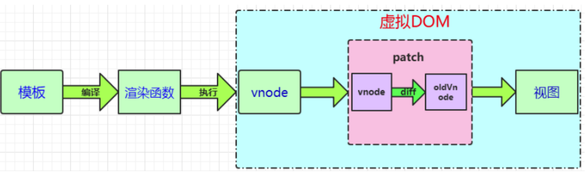

# 虚拟DOM理解
## 概述
VDOM是对DOM的抽象，本质上是JavaScript对象，这个对象就是更加轻量级的对DOM的描述

## 为什么需要VDOM
既然我们已经有了DOM，为什么还需要额外加一层抽象？<br>

首先，我们都知道在前端性能优化的一个秘诀就是尽可能少的操作DOM，不仅仅是DOM相对较慢，更因为频繁变动DOM会造成
浏览的回流或者重回，这些都是性能的杀手，因此我们需要这一层抽象，在patch过程中尽可能地一次性将差异更新到DOM中，
这样保证了DOM不会出现性能很差的情况


其次，前端框架的一个基本要求就是无需手动操作DOM，一方面是因为手动操作DOM无法保证程序性能，多人协作的项目中如果
review不严格，可能会有开发者写出性能较低的代码，另一方面更重要的是省略手动DOM操作可以大大提高开发效率


最后，也是VDOM最初的目的，就是更好的跨平台，比如Node.js就没有DOM，如果想实现SSR，那么一个方式就是借助VDOM，因为VDOM本身就是JS对象

## 模板转换成视图的过程
1、vue通过编译将template模板转换成渲染函数（render），执行渲染函数就可以得到一个虚拟节点树<br>
2、在对Model进行操作的时候，会触发对应Dep中的Watcher对象，Watcher对象会调用对应的update来修改视图，这个过程主要是将新旧节点进行差异对比，然后根据对比结果进行DOM操作来更新视图

简单来讲，在Vue的底层实现上，Vue将模板编译成虚拟DOM渲染函数，结合Vue自带的响应系统，在状态改变时，Vue能够智能地计算出重新渲染组件的最小代价并应到DOM操作上



渲染函数：渲染函数是用来生成Virtual DOM的，Vue推荐使用模板来构建我们的应用界面，在底层实现中Vue会将模板编译成渲染函数，当然我们也可以不写模板，直接写渲染函数，以获得更好的控制

VNode虚拟节点：它可以代表一个真实的dom节点，通过createElement方法能将VNode渲染成dom节点

patch（也叫做patching算法）：虚拟DOM最核心的部分，它可以将vnode渲染成真实的DOM，这个过程是对比新旧虚拟节点之间有哪些不同，然后根据对比结果找出需要更新的的节点进行更新。这点我们从单词含义就可以看出， 
patch本身就有补丁、修补的意思，其实际作用是在现有DOM上进行修改来实现更新视图的目的。Vue的Virtual DOM Patching算法是基于Snabbdom的实现，并在些基础上作了很多的调整和改进。

## Virtual DOM是什么？
Virtual DOM其实就是一棵以JavaScript对象（VNode节点）作为基础的树，用对象属性来描述节点，实际上它只是一层对真实DOM的抽象，最终可以通过一系列操作使这棵树映射到真实环境上

## Virtual DOM作用是什么？
虚拟DOM的最终目标是将虚拟节点渲染到视图上，但是如果直接使用虚拟节点覆盖旧节点的话，会有很多不必要的操作

为了避免不必要的DOM操作，虚拟DOM在虚拟节点映射到视图的过程中，将虚拟节点与上一次渲染视图所使用的旧虚拟节点（oldVnode）做对比，找出真正需要更新的节点来进行DOM操作，从而避免操作其他无需改动的DOM
 
* 虚拟DOM做了两件事：
1、提供与真实DOM节点所对应的虚拟节点Vnode<br>
2、将虚拟节点Vnode和旧虚拟节点oldVnode进行对比，然后更新视图
 
## VDOM的关键因素
### VDOM的创建
我们已经知道VDOM是对真是DOM的抽象，根据不同的需求我们可以做出不同的抽象。<br>

比如snabbdom.js的抽象方式是这样的：
```typescript
export interface VNode {
    sel: string | undefined;
    data: VNodeData | undefined;
    children: Array<VNode | string> | undefined;
    elm: Node | undefined;
    text: string | undefined;
    key: Key | undefined;
}
```

我们采用最简单的抽象方法：
```typescript
{
  type, // String，DOM 节点的类型，如 'div'
  data, // Object，包括 props，style等等 DOM 节点的各种属性
  children // Array，子节点
}
```

在明确了我们抽象的VDOM构造之后，我们就需要一个函数来创建VDOM
```typescript
/**
 * 生成 vnode
 * @param  {String} type     类型，如 'div'
 * @param  {String} key      key vnode的唯一id
 * @param  {Object} data     data，包括属性，事件等等
 * @param  {Array} children  子 vnode
 * @param  {String} text     文本
 * @param  {Element} elm     对应的 dom
 * @return {Object}          vnode
 */
function vnode(type, key, data, children, text, elm) {
  const element = {
    __type: VNODE_TYPE,
    type, key, data, children, text, elm
  }

  return element
}
```
这个函数很简单，接受一定的参数，在根据这些参数返回一个对象，这个对象就是DOM的抽象。

### VDOM Tree的创建
上面我们已经声明了一个vnode函数用于单个Virtual DOM的创建工作,但是我们都知道DOM其实是一个Tree,我们接下来要做的就是声明一个函数用于创建DOM Tree的抽象 -- Virtual DOM Tree.

## 参考文档

* [对虚拟DOM和Dom-Diff的理解？](https://segmentfault.com/a/1190000022277663)
* [面试官: 你对虚拟DOM原理的理解?](https://juejin.im/post/6844903902429577229)
