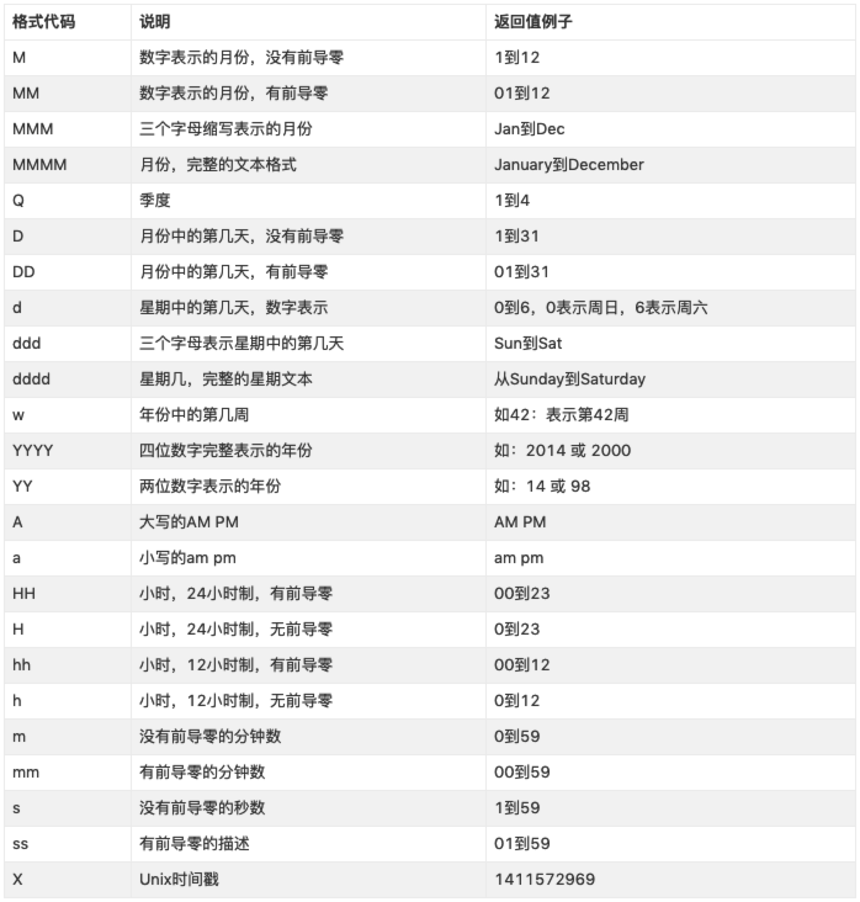

# 时间转换函数moment.js
## 常用的格式化参数如下表所示


## 常用的转换
### 时间格式化
```$xslt
moment().format('YYYY-MM-DD HH:mm:ss');获取当前时间 2018-09-18 12:06:09 

moment().format('L') 2018-07-04

moment().format('LL') 2018年7月4日

moment().format('LLL') 2018年7月4日晚上5点55分

moment().format('LLLL') 2018年7月4日星期三晚上5点55分

moment().format('X'); 转换当前时间的Unix时间戳

moment().format('d');  今天是周几
```
### 日期格式化
```$xslt
moment().format('dddd') 星期三

moment().format('MMM Do YY') 7月4日 18

moment().format() 2018-07-04T18:04:52+08:00
```

### 日历格式化
```$xslt
moment().subtract(1,'days').calendar();昨天下午5点55分

moment.calendar();今天下午5点55分

moment().add(1,'days').calendar();明天下午5点55分
```

## 参考文档

* [时间转换函数moment.js](https://www.jianshu.com/p/f3b2ac003542)
