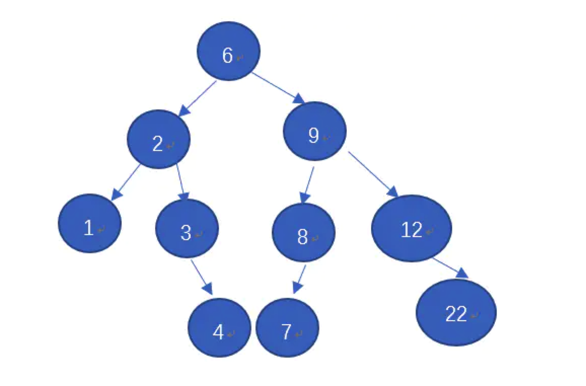

# 二叉树
## 什么是二叉树
二叉树是n个结点的有限集合，该集合或者为空集，或者由一个根结点和两颗互不相交的、分别称为根结点的左子树和右子树的二叉树组成。

## JS构建二叉树
约定右子树的节点值都大于左子树节点的值（也可以是左子树的节点值大于右子树的节点值），数组第一个元素作为根节点的值、根据数组元素的顺序构建二叉树。



首先通过类来定义二叉树，这个类具有节点的节点结构属性、根节点属性以及节点插入方法

```js
// 二叉树
function BinaryTree() {
    // 节点结构
    var Node = function(key) {
        this.key = key;
        this.left = null;
        this.right = null;
    };
    // 根节点
    var root = null;
    
    // 新增节点
    var insertNode = function(node, newNode) {
        // 约定右孩子都大于左孩子
        if (newNode.key < node.key) {
            // 如果没有左孩子，则新增左孩子
            if (node.left === null) {
                node.left = newNode
            } else {
                // 如果有左孩子则递归算法实现插入左孩子节点
                insertNode(node.left, newNode)
            }
        } else {
            // 如果右孩子为null, 则新增右孩子
            if (node.right === null) {
                node.right = newNode
            } else {
                // 如果有右孩子则递归算法实现插入右孩子节点
                insertNode(node.right, newNode)
            }
        }
    }
    // 插入新节点
    this.insert = function(key) {
        // 创建新节点
        var node = new Node(key)
        // 判断是否为根节点
        if (root === null) {
            root = node;
        } else {
            // 不是根节点则新增节点
            insertNode(root, node)
        }
    }
}

// 构建二叉树
var nodes = [6, 2, 3, 4, 9, 8,7,12,1,22]
var binaryTree = new BinaryTree();
nodes.forEach((key) => {
    binaryTree.insert(key)
})
```

## 二叉树的几种遍历方法
### 中序遍历
#### 原理
先处理左节点，接着处理中节点，最后处理右节点，递归遍历所有节点。
#### 实现
```js
// 中序遍历二叉树
var traverseNodesLDR = function(node, callback) {
    if (node !== null) {
        traverseNodesLDR(node.left, callback)
        callback(node.key)
        traverseNodesLDR(node.right, callback)
    }
}
// 中序遍历算法
this.LDR = function(callback) {
  traverseNodesLDR(root,callback)
}
```

### 前序遍历
#### 原理
先处理中节点，接着处理左节点，然后在处理右节点，递归遍历所有节点。
#### 实现
```js
// 前序遍历二叉树
var traverseNodesDLR = function(node, callback) {
  if (node !== null) {
      callback(node.key)
      traverseNodesDLR(node.left, callback)
      traverseNodesDLR(node.right, callback)
  }
}

// 前序遍历算法
this.DLR = function(callback) {
  traverseNodesDLR(root, callback)
}
```

### 后序遍历
#### 原理
先处理左节点（右节点），在处理右节点（左节点），最后处理中间节点。
#### 实现
```js
// 后序遍历二叉树
var traverseNodesLRD = function(node, callback) {
    if (node !== null) {
        traverseNodesLRD(node.left, callback)
        traverseNodesLRD(node.right, callback)
        callback(node.key)
    }
}

// 后序遍历算法
this.LRD = function(callback) {
  traverseNodesLRD(callback)
}
```

## 二叉树查找
首先需要理解什么是叶子：叶子即是没有左右孩子的节点

### 查找最大值算法实现
* 原理：查找右子树的右节点或中节点

```js
// 遍历右子树
var traverseRight = function(node, callback) {
    if (node !== null) {
        if (node.right !== null) {
            traverseRight(node.right, callback)
        } else {
            // 返回最大值
            callback(node.key)
        }
    } else {
        throw new TypeError('空二叉树')
    }
}

// 获取最大值
this.getMaxValue = function(callback) {
  traverseRight(root, callback)
}
```

### 查找最小值算法实现
* 原理：在左子树中查找左叶子节点或中节点

```js
// 遍历左子树
var traverseLeft = function(node, callback) {
  
    if (node !== null) {
        if (node.left !== null) {
            traverseLeft(node.left, callback)
        } else {
            // 返回最小值
            callback(node.key)
        }
    } else {
         throw new TypeError('空二叉树')
    }
}

// 获取最小值
this.getMinValue = function(callback) {
  this.traverseLeft(root, callback)
}
```

### 判断一个值是否在二叉树中算法实现
* 原理：判断给定的值是否大于根节点，大于递归遍历右子树，小于遍历左子树，存在则返回true，否则false

```js
// 遍历查找二叉树
var traverseNode = function(node, key) {
    if (node === null) {
        return false
    } 
    if (node.key < key) {
        return traverseNode(node.rigth, key)
    } else if (node.key > key) {
        return traverseNode(node.left, key)
    } else {
        return true
    }
}

// 查找指定的值是否在二叉树中
this.isExitIntree = function(key) {
    return traverseNode(key)
}
```

### 节点删除算法实现
>原理：<br>
1、删除叶子节点(左右孩子节点都没有)，直接把叶子节点设置为null<br>
2、删除仅包含左子节点的中节点，把左孩子节点指向null<br>
3、删除仅包含右子节点的中节点，把右孩子节点设置为null<br>
4、删除左右节点都有的中间节点，查找右子树的最小节点值，替换删除节点值，并把右子树最小的节点值删除<br>

```js
// 删除节点
var removeNode = function(node, key) {
    if (node === null) {
        return null
    } 
    if (key < node.key) {
        node.left = removeNode(node.left, key)
        return node
    } else if (key > node.key) {
        node.right = removeNode(node.right, key)
        return node
    } else { 
        // 删除节点
        // 1、删除没有左右子树的节点
        if (node.left === null && node.right === null) {
            node = null
            return node
        }
        // 2、删除只有右子树的节点
        if (node.left === null) {
            node = node.right
            return node
        }
        // 3、删除只有左子树的节点
        if (node.right === null) {
            node.left = node
            return node
        }
        // 4、删除左右子树都有的节点
        // 4.1 查找右子树中最小的节点N
        var minNode = getMinNode(node.right)
        // 4.2用N替换需要删除的节点
        node.key = minNode.key
        // 4.3删除右子树最小的节点
        node.right = removeNode(node.right, minNode.key)
        return node
    }
}

this.deleteNode = function(key) {
    removeNode(root, key)
}
```

## 参考文档
* [JS 前序遍历、中序遍历、后序遍历、层序遍历详解，深度优先与广度优先区别，附leetcode例题题解答案](https://www.cnblogs.com/echolun/p/13328927.html)
