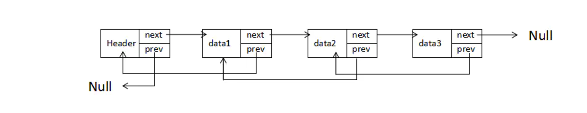
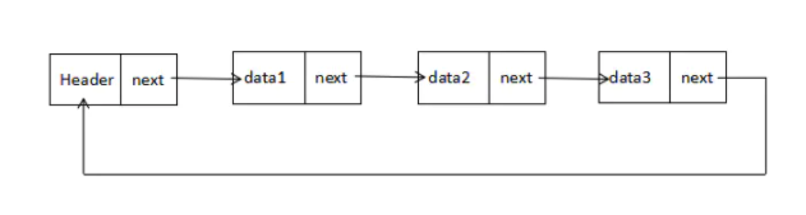

# 链表
## 简介
链表是什么？

链表是一种动态的数据结构，这意味着我们可以任意增删元素，它会按需扩容。

为何要使用链表？

* 因为数组的存储有缺陷：增删元素时往往需要移动元素，而链表在内存中的放置并不是连续的，元素通过next属性指向下个元素，所以链表增删元素，不需要移动元素，只需要更改next的指向即可

* 在生活中最形象的链表莫过于火车了，车头是head，每一节车厢都有一个next用于连接后面的车厢，想增删车厢，只需要更改next即可

* 在使用分离链接法解决散列表冲突时，我们也会用链表存储位置冲突的元素

## 链表的定义
链表是一组节点组成的集合，每个节点都使用一个对象的引用来指向它的后一个节点，指向另一节点的引用叫做链

(data1, next) -> (data2, next) -> (data3, next) -> Null

其中data保存着数据，next保存着下一个链表的引用，上图中，我们说data2跟在data1后面，
而不是说element2是链表中的第二个元素。

值得注意的是，我们将链表的尾元素指向了null节点，表示链接结束的位置。

* 有头节点的链表

由于链表的起始点的确定比较麻烦，因此很多链表的实现都会在链表的最前面添加一个特殊的节点，称为头节点，表示链表的头部。

(Header, next) -> (data1, next) -> (data2, next) -> (data3, next) -> Null

* 插入节点

向链表中插入一个节点的效率很高，需要修改它前面的节点（前驱），使其指向新加入的节点，而将新节点指向原来前驱节点指向的节点即可。

(Header, next) -> (data1, next) -> (data2, next) -> (data4, next) -> (data3, next) -> Null

* 删除节点

从链表中删除一个节点，只需要将待删节点的前驱节点指向待删节点的指向的节点，同时将待删节点指向null，那么节点就删除成功了

## 链表的设计
我们设计链表包含两个类，一个是Node类用来表示节点，另一个是LinkedList类提供插入节点、删除节点等一些操作

### Node类
Node类包含两个属性：element用来保存节点上的数据，next用来保存指向下一个节点的链接

```js
// 节点
function Node(element) {
  this.element = element; // 当前节点的元素
  this.next = null; // 下一个节点链接
}
```

### LinkedList类
LinkedList类提供类对链表进行操作的方法，包括插入删除节点，查找给定的值等等，值得注意的是，它只有一个属性，那就是使用一个Node对象来保存该链表的头节点

它的构造函数的实现如下：
```js
// 链表类
function LList() {
   this.head = new Node('head'); // 头节点
   this.find = find 
   this.insert = insert;
   this.remove = remove;
   this.findPrev = findPrev;
   this.display = display;
}
```

head节点的next属性初始化为null，当有新元素插入时，next会指向新的元素

#### find: 查找给定节点

```js
// 查找给定节点
function find(item) {
    var currNode = this.head;
    while (currNode.elements !== item) {
        currNode = currNode.next
    }
    return currNode
}
```
find方法同时展示了如何在链表上移动。

首先，创建一个新节点，将链表的头节点赋给这个新创建的节点，然后在链表上循环，如果当前节点的element属性和我们要找的信息不符，就将当前节点移动到下一个节点，
如果查找成功，该方法返回包含数据的节点，否则就会返回null。

#### insert: 向链表插入一个节点
想要插入一个节点，我们必须明确要在哪个节点的前面或后面插入。

一旦找到节点，我们就可以将新的节点插入到链表中了，将新节点的next属性设置为后面节点的next属性对应的值，然后设置后面节点的next属性指向新的节点，

```js
// 插入节点
function insert(newElement, item) {
    var newNode = new Node(newElement);
    var currNode = this.find(item);
    newNode.next = currNode.next;
    currNode.next = newNode;
}
```

#### display: 显示链表

```js
// 显示链表
function display() {
    var currNode = this.head
    while (!(currNode.next == null)) {
        console.log(currNode.next.element)
        currNode = currNode.next;
    }
}

var fruits = new LList();

fruits.insert('Apple', 'head')
fruits.insert('Banana', 'Apple')
fruits.insert('Pear', 'Banana')

console.log(fruits.display()) // Apple、Banana、Pear
```

实现原理同上，将头节点赋给一个新的变量，然后循环链表，直到当前节点的next属性为null时停止循环，我们循环过程中将每个节点的数据打印出来就好

#### remove: 从链表中删除一个节点

从链表中删除节点时，我们先要找到待删除节点的前一个节点，找到后，我们修改它的next属性，使其不在指定待删除的节点，而是待删除节点的下一个节点。
那么，我们就得需要定义一个findPrevious方法遍历链表，检查每一个节点下一个节点是否存储待删除的数据，如果找到，返回该节点，这样就可以修改它的next属性了

```js
// 查找带删除节点的前一个节点
function findPrev(item) {
    var currNode = this.head;
    while ( !(currNode.next === null) && (currNode.next.element != item) ) {
        currNode = currNode.next
    }
    return currNode
}

// 删除节点

function remove(item) {
    var prevNode = this.findPrev(item);
    if ( !(prevNode.next === null) ) {
        prevNode.next = prevNode.next.next;
    }
}

fruits.remove('Banana');
```

## 双向链表
尽管从链表的头节点遍历链表很简单，但是反过来，从后向前遍历却不容易，我们可以通过给Node类增加一个previous属性，让其指向前驱节点的链接，这样就形成了双向链表



此时，向链表插入一个节点就要更改节点的前驱和后继了，但是删除节点的效果提高了，不在需要寻找待删除节点的前驱节点了

### 双向链表的实现
要实现双向链表，首先需要给Node类增加一个previous属性

```js
// 节点类-增加属性
function Node(element) {
    this.element = element; // 当前节点元素数据
    this.next =  null; // 下一个节点链接
    this.previous = null; // 上一个节点链接
}
```

双向链表的insert方法与单链表相似，但需要设置新节点的previous属性，使其指向该节点的前驱，定义如下：

```js
function insert(element, item) {
    var newNode = new Node(element);
    var currNode = this.find(item);
    newNode.next = currNode.next;
    newNode.previous = currNode;
    currNode.next = newNode;
}
```

双向链表的删除remove方法比单链表效率高，不需要你查找前驱节点，只要找出待删除节点，然后将该节点的前驱next属性指向待删除节点的后继，设置该节点后继previous属性，指向待删除节点的前驱即可

```js
// 删除节点
function remove(item) {
    var currNode = this.find(item);
    if ( !(currNode.next == null) ) {
        currNode.previous.next = currNode.next;
        currNode.next.previous = currNode.previous;
        currNode.next = null;
        currNode.previous = null;
    }
}
```


## 循环链表
循环链表和单链表相似，节点类型都是一样的，唯一的区别是，在创建循环链表的时候，让其头节点的next属性指向它本身，即

```js
head.next = head
```

这种行为会导致链表中每个节点的next属性都指向链表的头节点，换句话说，也就是链表的尾节点指向了头节点，形成了一个循环链表



## 用处

react-fiber就是双向链表的一种实现

react hooks的实现就用到链表结构


## 参考文档

* [JavaScript 版数据结构与算法（三）链表](https://www.liuyiqi.cn/2017/02/15/linked-list/)
* [JS中的算法与数据结构——链表(Linked-list)](https://juejin.cn/post/6844903498362912775)
