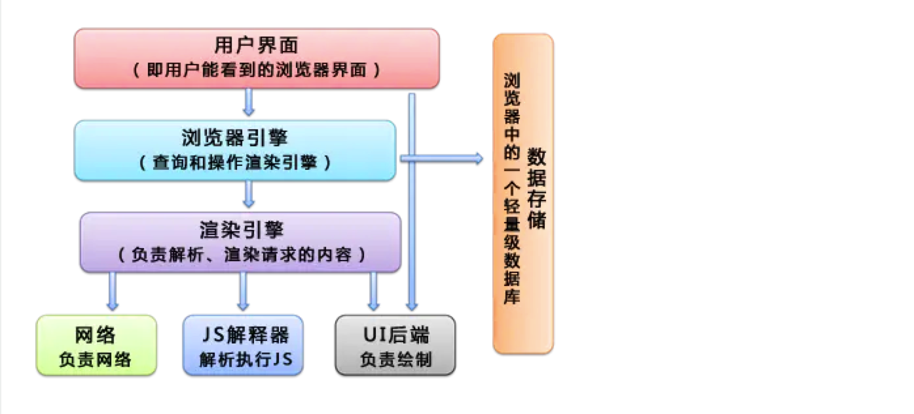
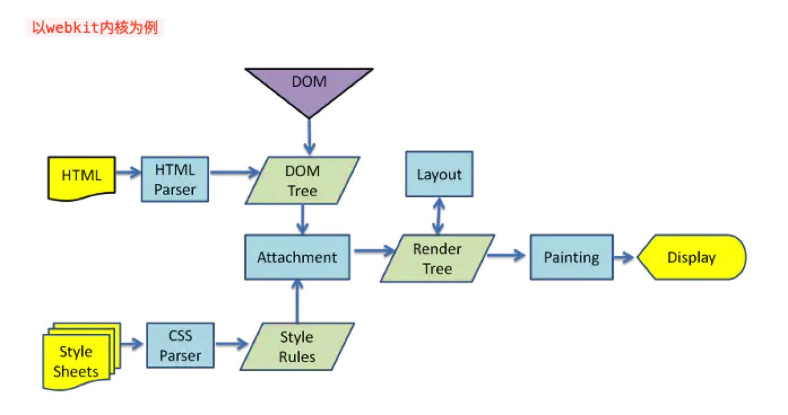
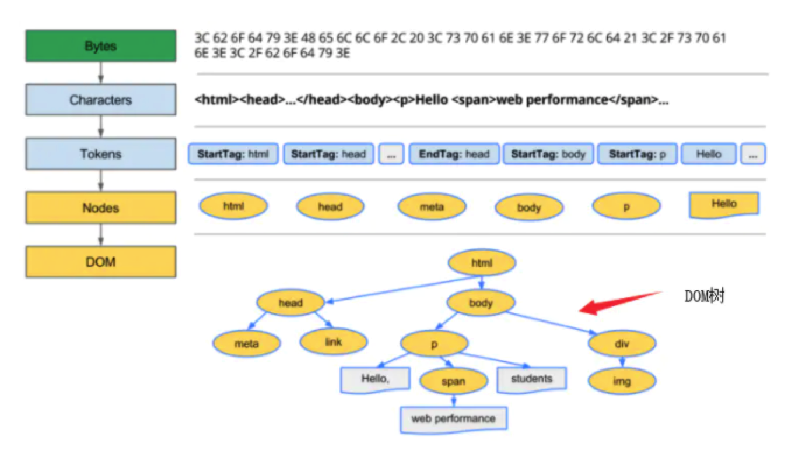

# 浏览器渲染步骤
## 前言
浏览器内核是指支持浏览器运行的最核心的程序，分为两个部分：渲染引擎、JS引擎，渲染引擎在不同的浏览器中也不是都相同的<br>
目前市场上常见的浏览器内核可以分为这四种：Trident(IE)、Gecko(火狐)、Blink(Chrome、Opera)、Webkit(Safari)
## 浏览器主要组件结构


## 渲染步骤
根据url请求、DNS解析、TCP连接、服务器处理返回请求后得到的其实是一堆HTML格式的字符串，因为只有HTML格式浏览器才能正确解析，这是W3C标准要求。
* 接下来就是浏览器的渲染过程
```$xslt
1、解析HTML，构建DOM树
2、解析CSS，生成CSS规则树  // 1 2 步骤是并行执行的
3、合并DOM树和CSS规则，生成render树
4、布局render树（layout/reflow），负责各元素尺寸、位置的计算
5、绘制render树（paint），绘制页面像素信息
```

>浏览器渲染过程大体分为三部分：浏览器解析、构造Rendering Tree、API绘制

### HTML -> DOM树（解析HTML）
DOM全称为文档对象模型（Document Object Model），其中一个DOM节点对应一个标签，DOM树即表示了HTML的文档结构
```$xslt
解析过程: Bytes -> characters -> tokens -> nodes -> DOM
```


1、解码：浏览器从磁盘或网络读取html的原始字节，然后根据指定的文件编码格式将其转换为相应字符<br>
2、令牌化：浏览器把字符转化成W3C html5标准指定的各种确切的令牌，比如""以及其他在尖括号内的字符串，每个令牌都有特殊的含义以及它自己的一套规则<br>
3、词法分析：生成的令牌转化为对象，这个对象定义了它们的属性及规则<br>
4、DOM树：最后，由于html标记定义了不同标签之间的关系，创建的对象在树状的数据结构中互相链接，树状数据结构也捕获了原始标签定义的父子关系：<br>
html对象是body对象的父对象，body是p对象的父对象等等

### CSS -> CSSOM树（解析CSS样式）
```$xslt
解析过程: Bytes -> Characters -> Tokens -> Nodes -> CSSOM
```
### 生成渲染树Rendering tree
### layout 
依照盒子模型，计算出每个节点在屏幕中的位置以及尺寸--- 负责各元素尺寸、位置的计算
### painting 
按照计算出来的规则，通过显卡，把内容画到屏幕上---绘制页面像素信息

## 问题
1、浏览器在什么时候向服务器发送获取css、js外部文件的请求<br>
解析DOM时碰到外部链接，如果还有connection，则立即触发下载请求<br>

2、CSSOM DOM javaScript三者阻塞关系<br>
CSSOM DOM互不影响，javaScript会阻塞DOM树的构建但JS前的HTML可以正常解析成DOM树，CSSOM会阻塞javaScript的执行<br>

这也解释了为什么javaScript的执行都需要访问DOM和CSSOM的能力，却只受CSSOM的阻塞


## 参看文档
* [你不知道的浏览器页面渲染机制](https://juejin.im/post/5ca0c0abe51d4553a942c17d)
* [页面渲染：过程分析](https://juejin.im/post/5b879d0fe51d4538843631c1)
* [【干货】十分钟读懂浏览器渲染流程](https://juejin.im/post/5a8e242c5188257a6b060000)
