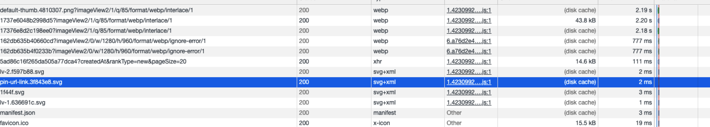

# 浏览器缓存机制（http缓存）
## 概述
* 缓存的机制原理：根据HTTP报文的缓存标识进行的

## 缓存过程分析
浏览器和服务器之间的通信的方式是应答模式，即是：浏览器发起HTTP请求---服务器响应请求。<br>
那么浏览器第一次向服务器发起该请求后拿到请求结果，会根据响应报文中HTTP头的缓存标识，决定是否缓存结果，是 则将请求结果和缓存标识存入浏览器缓冲中。

```$xslt
浏览器每次发起请求，都会先在浏览器缓存中查找该请求的结果以及缓存标识

浏览器每次拿到返回的请求结果都会将该结果和缓存标识存入浏览器缓存中
```
## 强制缓存
* 强制缓存就是向浏览器缓存查找该请求结果，并根据该结果的缓存规则来决定是否使用该缓存结果的过程<br>

强制缓存的情况主要有三种

```$xslt
1、强制缓存失效，直接向服务器请求
不存在该缓存结果和缓存标识，强制缓存失效，则直接向服务器发起请求 --- 跟第一次发起请求一致

2、强制缓存失效，使用协商缓存
存在该缓存结果和缓存标识，但该结果已失效，强制缓存失效，则使用协商缓存

3、存在该缓存结果和缓存标识，且该结果尚未失效，强制缓存生效，直接返回该结果
```
### 强制缓存的缓存规则
当浏览器向服务器发起请求时，服务器会将缓存规则放入HTTP响应报文和HTTP头中  和请求结果一起返回给浏览器，控制强制缓存的字段分别是Expires 和 Cache-Control,
其中Cache-control优先级比Expires高

### Expires
Expires是HTTP/1.0控制网页缓存的字段，其值为服务器返回该请求缓存的到期时间，即再次发起该请求时，如果客户端的时间小于Expires的值时，直接使用缓存结果

```$xslt
HTTP/1.1中Expires已经被Cache-Control替代

原因：在于Expires控制缓存的原理是使用客户端的时间与服务端返回的时间做对比，那么如果客户端与服务端的时间因为某些原因（例如时区不同等等）发生误差，那么强制缓存则会直接失效

这样的话强制缓存的存在就毫无意义了
```

### Cache-Control
```$xslt

在HTTP/1.1中，Cache-Control是最重要的规则，主要用于控制网页缓存

public: 所有内容都将被缓存（客户端和代理服务器都可缓存）
private: 所有内容只有客户端可以缓存，Cache-Control的默认取值
no-cache: 客户端缓存内容，但是是否使用缓存则需要经过协商缓存来验证决定
no-store: 所有内容都不会被缓存，即不使用强制缓存，也不使用协商缓存
max-age=xxx (xxx is numeric): 缓存内容将在xxx秒后过期

```
注：在无法确定客户端的时间是否与服务端的时间同步的情况下，Cache-Control相比于expires是更好的选择，所以同时存在时，只有Cache-Control生效


状态码为灰色的请求则代表使用了强制缓存，请求对应的Size值则代表该缓存存放的位置，分别为from memory cache 和 from disk cache<br>



* 内存缓存(from memory cache): 代表使用内存的缓存
```$xslt
快速读取：
```


* 硬盘缓存(from disk cache): 代表使用的硬盘中的缓存，浏览器读取缓存中的顺序为memory -> disk


## 参考文档
* [彻底了解浏览器缓存机制](https://juejin.im/entry/5ad86c16f265da505a77dca4)
