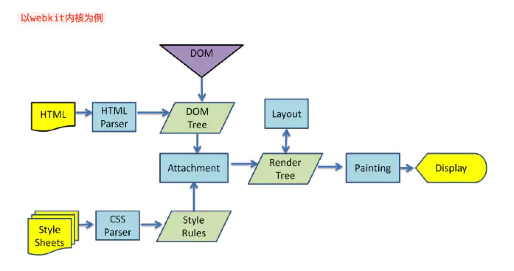

# 网页被浏览器渲染的过程
## 总体过程
```$xslt
1、URL输入
2、DNS解析
3、TCP连接
4、发送HTTP请求
5、服务器处理请求
6、服务器响应请求
7、浏览器解析渲染页面
8、连接结束
```
## URL输入
>URL中文名叫做统一资源定位符，统一资源定位符是对可以从互联网上得到的资源的位置和访问方法的一种简洁的表示，
是互联网上标准资源的地址，互联网上的每一个文件都有一个唯一的URL，它包含的信息指出文件的位置以及浏览器应该怎么处理它（俗称网址）

主要组成部分：scheme: // host.domain:port / path / filename ? abc = 123 # 456789
```$xslt
scheme: 定义因特网服务的类型，常见的协议有http、https、ftp、file
host: 定义域主机
domain: 定义因特网域名，比如baidu.com
port: 定义主机上的端口号（http默认的是80、https默认的是443）
path: 定义服务器上的路径
filename: 定义文档/资源的名称
query: 即查询参数
fragment: 即#后的hash值，一般用来定位到某个位置 
```
### 补充：url 和 uri 的区别
```$xslt
uli是通用资源标识符，而url是统一资源定位符

可以这样理解：
uri可以表示一个域，也可以表示一个资源
url只能表示一个资源
```
笼统的说，每个URL都是URI，但不一定每个URI都是URL。

## DNS解析
### 解析过程
>DNS解析的过程就是寻找哪台机器上有你需要的资源的过程。当你在浏览器中输入一个地址时，例如www.baidu.com，其实不是百度网站的真正意义上的地址。

真正的查找顺序：浏览器缓存 -> 操作系统缓存 -> 本地host -> 路由器缓存 -> ISP DNS缓存 -> 顶级DNS服务器/根DNS服务器 

```$xslt
* 浏览器缓存
首先会向浏览器的缓存中读取上一次访问的记录，在chrome可以通过地址栏中输入chrome://net-internals/#dns查询缓存的当前状态
* 操作系统缓存
查找存储在系统运行内存中的缓存。
* hosts文件
查看本地硬盘的hosts文件，看看其中有没有和这个域名对应的规则，如果有的化就直接使用hosts文件里面的ip地址
* 路由器缓存
有些路由器也有DNS缓存的功能，访问过的域名会存在路由器上。
* ISP DNS缓存
互联网服务提供商（如中国电信）也会提供DNS服务
* 顶级DNS服务器/根DNS服务器 
根域名收到请求后，会判别这个域名（.com）是授权给哪台服务器管理，并返回这个顶级DNS服务器IP
```
>本地DNS服务器向域名的解析服务器发出请求，这时就能收到一个域名和IP地址对应关系，本地DNS服务器不仅要把IP地址返回给用户电脑，
还要把这个对应关系保存在缓存中，以备下次别的用户查询时，可以直接返回结果，加快网络访问

### 补充
#### 什么是DNS
>DNS（Domain Name System，域名系统），因特网上作为域名和IP地址相互映射的一个分布式数据库，能够使用户更方便的访问互联网，而不是去记住能够被机器直接读取的IP数串。
通过主机名，最终得到该主机名对应的IP地址的过程叫做域名解析
#### DNS查询的两种方式：递归查询和迭代查询
1、递归解析<br>
当局部DNS服务器自己不能回答客户机的DNS查询时，它就需要向其他DNS服务器进行查询
2、迭代解析<br>
当局部DNS服务器自己不能回答客户机的DNS查询时，可以通过迭代查询的方式进行解析
#### DNS域名称空间的组织方式
根域：DNS域名中使用时，规定由尾部句点（.）来指定名称位于根域或更高级别的域层次结构  示例：单个句点（.）或句点用于末尾的名称<br>
顶级域：用来指示某个国家/地区或组织使用的名称的类型名称 示例：.com<br>
第二层域：个人或组织在Internet上使用的注册名称 示例：qq.com<br>
子域：已注册的二级域名派生的域名，通俗的讲就是网站名 示例：www.qq.com<br>
主机名：通常情况下，DNS域名的最左侧的标签标识网络上的特定计算机 示例：h1.www.qq.com
#### DNS优化
1、DNS缓存
2、DNS负载均衡<br>
```$xslt
原因：当一个网站有足够多的用户时，假如每次请求的资源都位于同一台机器上面，那么这台机器随时可能会崩掉

原理：是在DNS服务器中为同一主机名配置多个IP地址，在应答DNS查询时，DNS服务器对每个查询将以DNS文件中主机记录的IP地址按顺序返回不同的解析结果，将客户端的访问引导到不同的机器上去，使得不同的客户端访问不同的服务器，从而达到负载均衡的目的。

例如：可以根据每台机器的负载量，该机器离用户地理位置的距离等等
```
## TCP连接（TCP三次握手）
详细过程计算机网络中已讲解
## 发送HTTP请求
TCP三次握手结束之后，开始发送HTTP请求报文
## 服务器处理请求
每台服务器上都会有处理请求的应用---web server，常见的web server产品有apache、nginx等等
## 服务器响应请求
服务器上的应用程序处理完HTTP请求之后，返回HTTP响应报文
## 浏览器解析渲染页面
浏览器内核拿到内容之后，渲染步骤大致可以分为以下几步：
```$xslt
1、解析HTML，构建DOM树
2、解析CSS，生成CSS规则树
3、合并DOM树和CSS规则，生成render树
4、布局render树（layout/reflow），负责各元素尺寸、位置的计算
5、绘制render树（paint），绘制页面像素信息
```


渲染的详细过程，放在另一篇文章中～～～

## 参考文档
* [从输入URL到页面展示，你想知道些什么](https://juejin.im/post/5b148a2ce51d4506965908d2)
* [从URL输入到页面展现到底发生什么](https://juejin.im/post/5c7646f26fb9a049fd108380)
* [“天龙八步”细说浏览器输入URL后发生了什么](https://www.xuecaijie.com/it/157.html#1Q64p5DeC8dKFF)
