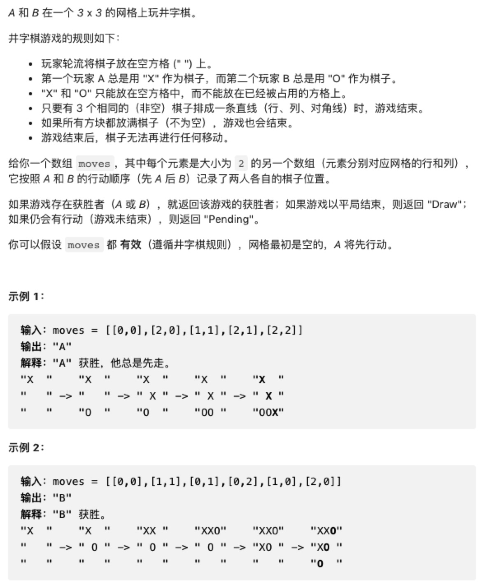

# 找出井字棋获胜者



```js
/**
 * @param {number[][]} moves
 * @return {string}
 */
var tictactoe = function(moves) {
    let result = Array.from({length: 9}, item => '')
    let lines = [[0, 1, 2], [3, 4, 5], [6, 7, 8], [1, 3, 6], [1, 4, 7], [2, 5, 8], [0, 4, 8], [2, 4, 6]]
    for (let i=0 ; i<moves.length; i++) {
        if (i % 2 === 0) {
            result[moves[i][0] * 3 + moves[i][1]] = 'A'
        } else {
            result[moves[i][0] * 3 + moves[i][1]] = 'B'
        }
    }
    for (let i=0; i<lines.length; i++) {
        let [a, b, c] = lines[i]
        if (result[a] && result[a] === result[b] && result[a] === result[c]) {
            return result[a]
        }
    }
    return moves.length === 9 ? 'Draw' : 'Pending'
    
    
}
```

解题思路

由于moves数组代表步数的记录，所以考虑先通过moeves数组还原出棋盘的最终状态，再进行判断

1、构造一个长度为9的空数组result用于储存棋盘的最终状态

2、遍历moves数组，判断每一步是由谁下在了哪个位置
```
条件规定A总是先手，所以moves的偶数索引为A下的子，奇数索引为B下的子，可以根据索引的奇偶来将A或B填入result；

由于moves中的子数组对应了网格的行和列，所以最终落子位置（对应result数组的索引）为 moves[i][0] * 3 + moves[i][1]；
```

3、判断胜者的方法即罗列出所有三子连成一线的情况，再依次跟result数组对比，如果有人获胜，则直接返回result数组中相应索引的值即为胜者

4、如果没有判断出胜者，说明要么是平局（Draw），要么是还没下完（Pending），这是可以通过moves数组的长度来简单判断的
```
如果moves数组的长度为9，说明每个网格中都落了棋子，这种情况下没有胜者就一定是平局

如果moves数组的长度不为9，则说明还没下完
```

需要注意的是，你并不能在一开始就通过moves数组的长度来判断是Draw还是Pending，因为如果有一方在最后一步才赢，moves数组的长度也为9，却不是平局。
如果有人提前获胜了，moves数组的长度就不为9，这种情况也不能判定为Pending
