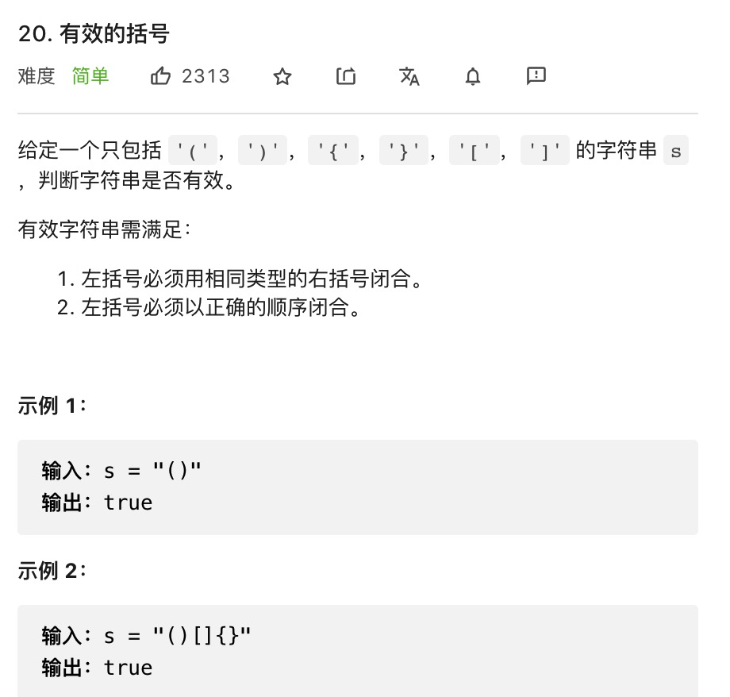

# 有效的括号



```
判断括号的有效性可以使用「栈」这一数据结构来解决。

我们遍历给定的字符串 ss。当我们遇到一个左括号时，我们会期望在后续的遍历中，有一个相同类型的右括号将其闭合。由于后遇到的左括号要先闭合，因此我们可以将这个左括号放入栈顶。

当我们遇到一个右括号时，我们需要将一个相同类型的左括号闭合。此时，我们可以取出栈顶的左括号并判断它们是否是相同类型的括号。如果不是相同的类型，或者栈中并没有左括号，那么字符串 ss 无效，返回 \text{False}False。为了快速判断括号的类型，我们可以使用哈希表存储每一种括号。哈希表的键为右括号，值为相同类型的左括号。

在遍历结束后，如果栈中没有左括号，说明我们将字符串 ss 中的所有左括号闭合，返回 \text{True}True，否则返回 \text{False}False。

注意到有效字符串的长度一定为偶数，因此如果字符串的长度为奇数，我们可以直接返回 \text{False}False，省去后续的遍历判断过程。
```

```js
var isValid = function(s) {
    s = s.split('');
    let sl = s.length;
    if (sl % 2) return false;
    let map = new Map([[')', '('], [']', '['], ['}', '{']]);
    let stack = [];
    for(let i of s){
        if (map.get(i)) {
            if (stack[stack.length - 1] !== map.get(i)) return false;
            else stack.pop();
        } else {
            stack.push(i);
        }
    }
    return !stack.length;
};
```


