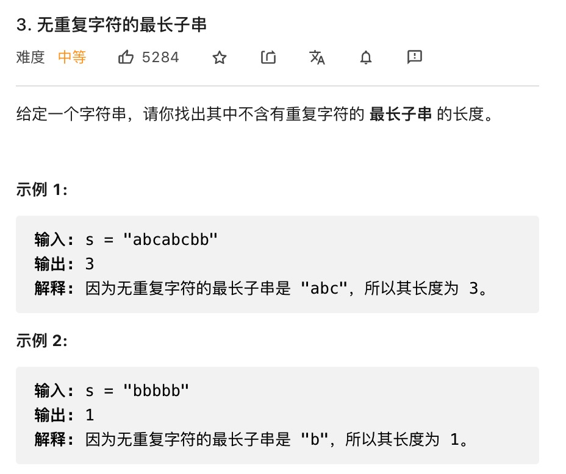

# 滑动窗口问题



思路：使用队列进行处理

```js
var lengthOfLongestSubstring = function(s) {
    let max = 0
    let queue = []
    for (let i=0; i<s.length; i++) {
        // 看字符是否已经存于队列中
        let index = queue.indexOf(s[i])
        // 存在 出队
        while(index+1) {
            queue.shift()
            index--
        }
        queue.push(s[i])
        max = Math.max(queue.length, max)
    }
    return max
}
```


