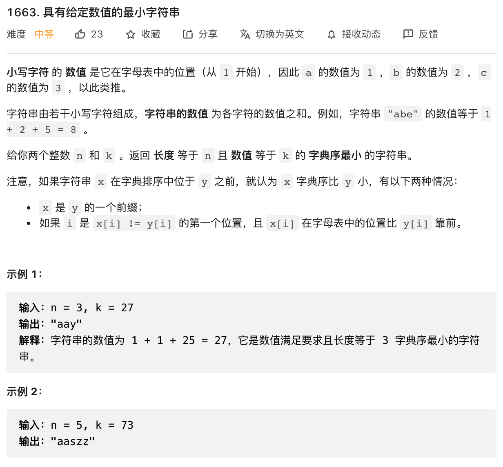

# 具有给定数值的最小字符串



思路

调用String.fromCharCode() 返回对应的字符是什么，小写a到z的取值范围是97——122 大写A到Z的顺序是65——90

````js
var getSmallestString = function(n, k) {
    let s = ''
    for (let i=1; i<=n; i++) {
        let charsValue = k - (n - i) * 26
        if (charsValue <= 0) {
          charsValue = 1
        }
        k = k - charsValue
        s += String.fromCharCode(96 + charsValue)
    }
    
}

getSmallestString(3, 25)
````


