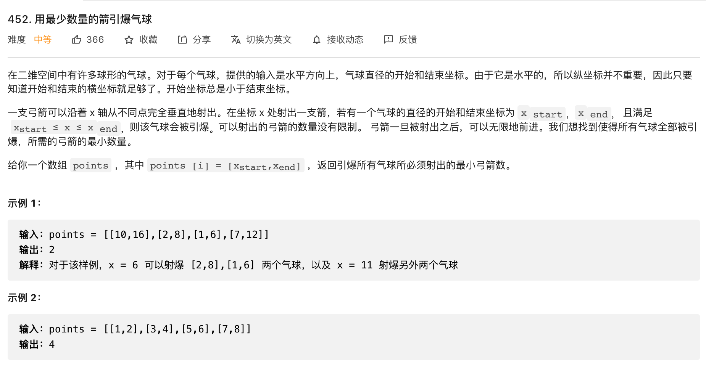

# 用最少数量的箭引爆气球



思路：

````js
// points = [[1,6],[2,8],[7,12],[10,16]] 2
var findMinArrowShots = function(points) {
    if (points.length === 0) {
        return 0
    }
    let num = 1
    points.sort((a, b) => a[1] - b[1])
    let arrow = points[0][1]
    for (let i=1; i<points.length; i++) {
        if (arrow < points[i][0] || arrow > points[i][1]) {
            arrow = points[i][1]
            num++
        }
    }
    return num
};
console.log(findMinArrowShots([[1,2],[2,3],[3,4],[4,5]]))
````
