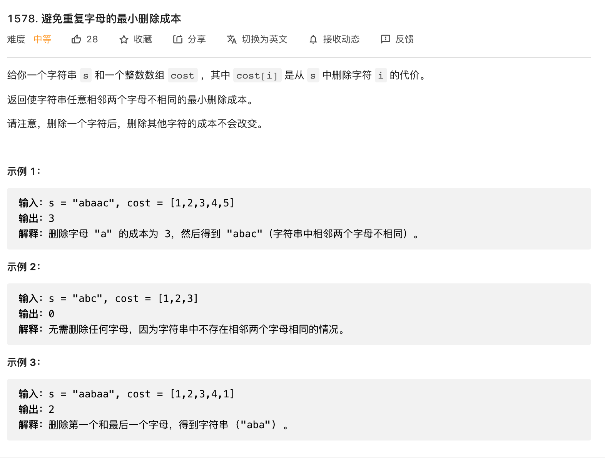

# 避免重复字母的最小删除成本



思路：成本 += 重复元素的成本之和 - 最大的成本

```js
const minCost = (s, cost) => {
    let result = 0
    for (let i=0; i<s.length; i++) {
        if (s[i] === s[i + 1]) {
            let costValue = cost[i]
            
            let maxValue = cost[i]
            
            while(s[i] === s[i + 1]) {
                maxValue = Math.max(maxValue, cost[i + 1])
                costValue += cost[i + 1]
                i++
            }
            
            result += costValue - maxValue
        }
    }
    return result
}


console.log(minCost("abaac", [1,2,3,4,5]))
```
