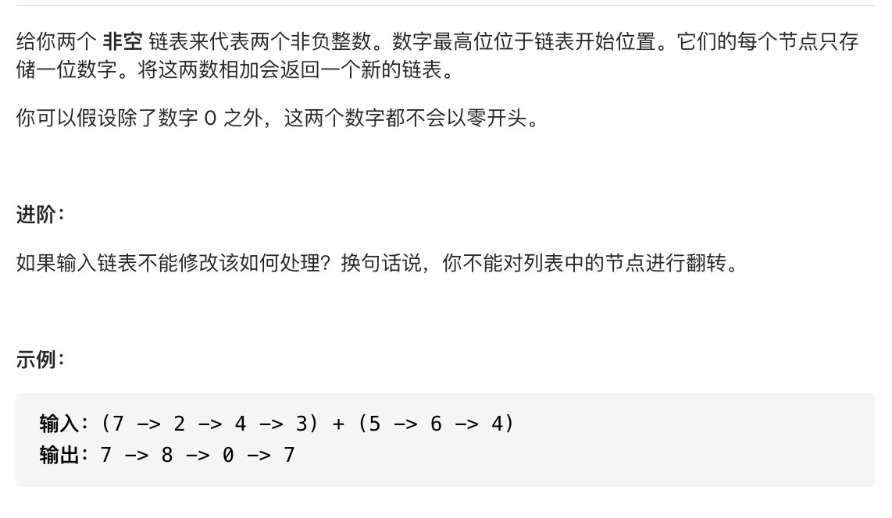

# 两数相加



```js
var addTwoNumbers = function(l1, l2) {
    let stack1 = []
    let stack2 = []
    let stack  = []
    let curried = 0
    let cur1 = l1
    let cur2 = l2
    
    while (cur1) {
        stack1.push(cur1.val)
        cur1 = cur1.next
    }
    while (cur2) {
        stack2.push(cur2.val)
        cur2 = cur2.next
    }
    let a = null
    let b = null
    while (stack1.length > 0 || stack2.length > 0) {
        a = Number(stack1.pop()) || 0
        b = Number(stack2.pop()) || 0
        stack.push((a + b + curried) % 10)
        
        if (a + b + curried >= 10) {
           curried = 1 
        } else {
           curried = 0
        }
    }
    if (curried === 1) {
        stack.push(1)
    }
    
    let node = {}
    let current = node
    while (stack.length > 0) {
        current.next = {
            val: stack.pop(),
            next: null
        }
        current = current.next
    } 
    
    return node.next
    
    
};
```

