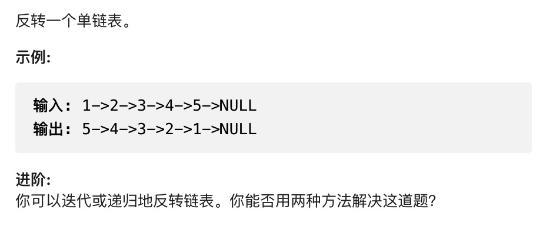

# 反转链表



思路：链表问题比较常规的解决方法就是快慢指针，或者有时候需要三个指针来进行操作，反转链表就是利用三个指针进行操作

````js
/**
 * Definition for singly-linked list.
 * function ListNode(val, next) {
 *     this.val = (val===undefined ? 0 : val)
 *     this.next = (next===undefined ? null : next)
 * }
 */
/**
 * @param {ListNode} head
 * @return {ListNode}
 */
var reverseList = function(head) {
    let prev = null, cur = head
    while (cur) {
        let next = cur.next
        cur.next = prev
        prev = cur
        cur = next
    }
    return prev
};
````
