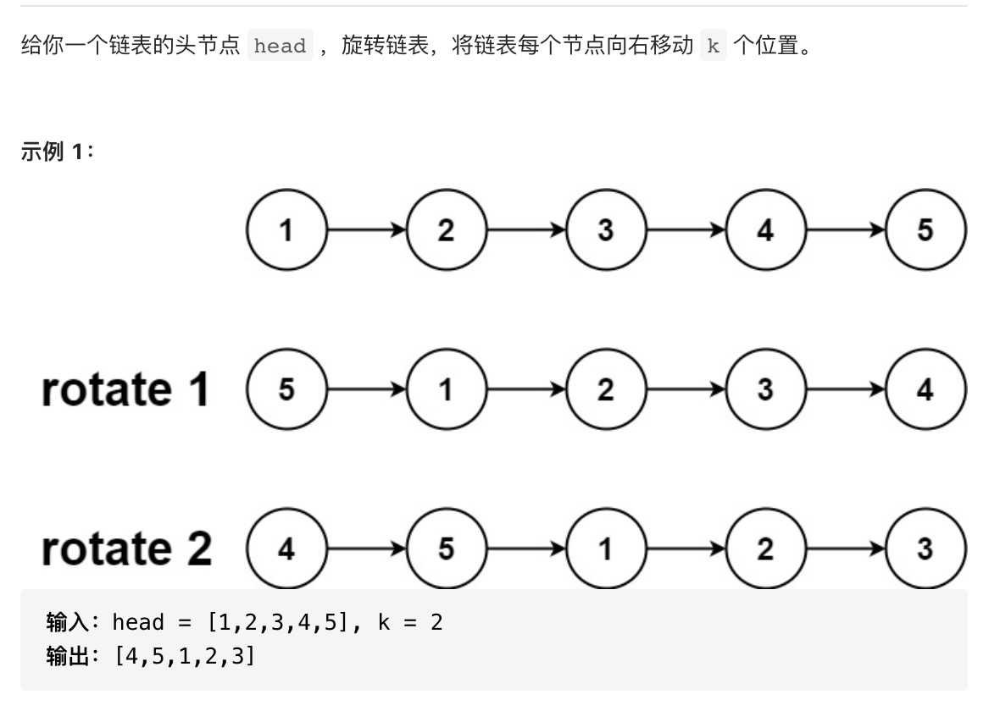

# 旋转链表



思路：形成环，在切割

````js
var rotateRight = function(head, k) {
   if (k === 0 || !head) {
       return head
   }
   let cur = head
   let n = 1
   while (cur.next) {
       cur = cur.next
       n++
   } 
   let add = n - k % n
   if (add === n) {
       return head
   }
  
   cur.next = head
   while (add) {
       cur = cur.next
       add--
   }
   let result = cur.next
   cur.next = null
   return result
}
````
