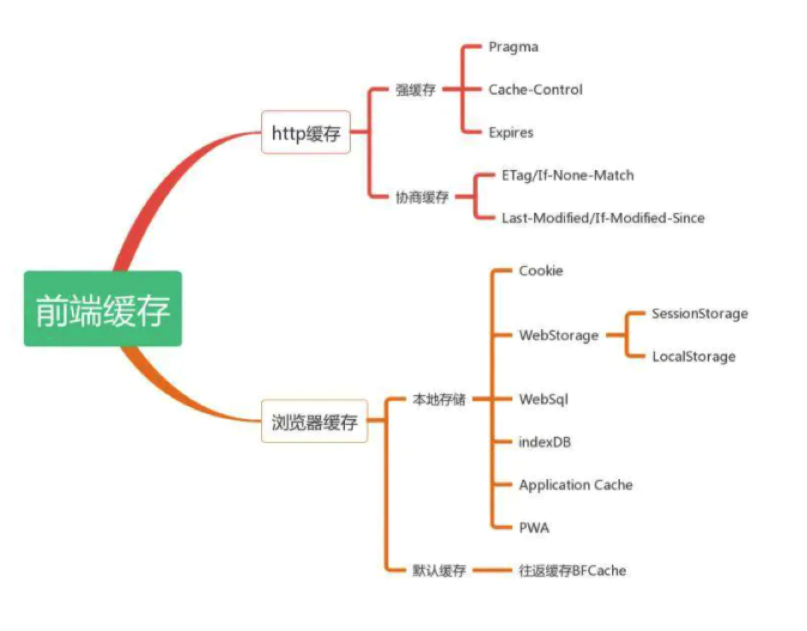

# HTTP缓存策略
# 概览
通过复用以前获取的资源，可以显著提高网站和应用程序的性能。Web缓存减少了等待时间和网络流量，因此减少了显示资源表示形式所需的时间。
通过使用HTTP缓存，变得更加响应性。

## 缓存分类
前端缓存可分为两大类：http缓存和浏览器缓存

下图即前端缓存的知识图谱

## 什么是HTTP缓存
http缓存指的是：当客户端向服务器请求资源时，会先抵达浏览器缓存，如果浏览器有"要请求资源"的副本，就可以直接从浏览器缓存中提取而不是从原始服务器中提取这个资源

常见的http缓存只能缓存get请求响应的资源，http缓存都是从第二次请求开始的，第一次请求资源时，服务器返回资源，并在response header头中回传资源的缓存参数；
第二次请求时，浏览器判断这些请求参数，命中强缓存就直接200，否则就把请求参数加到request header头中传给服务器，看是否命中协商缓存，命中则返回304，否则服务器会返回新的资源

## http缓存的分类

## 参考文档

* [深入理解HTTP缓存机制及原理](https://juejin.cn/post/6844903801778864136)

