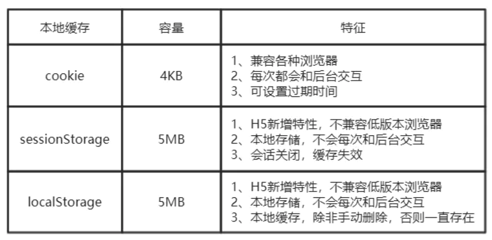

# HTTP缓存策略
## 概览
通过复用以前获取的资源，可以显著提高网站和应用程序的性能。Web缓存减少了等待时间和网络流量，因此减少了显示资源表示形式所需的时间。
通过使用HTTP缓存，变得更加响应性。

## 缓存分类
前端缓存可分为两大类：http缓存和浏览器缓存

下图即前端缓存的知识图谱

## 什么是HTTP缓存
http缓存指的是：当客户端向服务器请求资源时，会先抵达浏览器缓存，如果浏览器有"要请求资源"的副本，就可以直接从浏览器缓存中提取而不是从原始服务器中提取这个资源

常见的http缓存只能缓存get请求响应的资源，http缓存都是从第二次请求开始的，第一次请求资源时，服务器返回资源，并在response header头中回传资源的缓存参数；
第二次请求时，浏览器判断这些请求参数，命中强缓存就直接200，否则就把请求参数加到request header头中传给服务器，看是否命中协商缓存，命中则返回304，否则服务器会返回新的资源

## http缓存的分类
根据是否需要重新向服务器发起请求来分类，可分为（强制缓存和协商缓存）根据是否可以被单个或者多个用户使用来分类，可分为（私有缓存和共享缓存）强制缓存如果生效，不需要在和服务器发生交互，
而协商缓存不管是否生效，都需要与服务端发生交互，而协商缓存不管是否生效，都需要与服务器发生交互。

### 强制缓存
强制缓存在缓存数据未失效的情况下（即Cache-Control的max-age没有过期或者Expires的缓存时间没有过期），那么就会直接使用浏览器的缓存数据，不会在向服务器发送任何请求。
强制缓存生效时，http状态码为200，这种方式页面的加载速度是最快的，性能也是最好的，但是在这期间，如果服务器端的资源修改了，页面上是拿不到的，因为它不会在向服务器发请求了。

### 协商缓存
当第一次请求时服务器返回的响应头中没有Cache-Control和Expires或者Cache-Control和Expires过期或者它的属性设置为no-cache时（即不走强缓存），
那么浏览器第二次请求时就会与服务器进行协商，与服务器端对比判断资源是否进行了修改更新。

如果服务器端的资源没有修改，那么就会返回304状态码，告诉浏览器可以使用缓存中的数据，这样就可以减少了服务器的数据传输压力。

如果数据有更新就会返回200状态码，服务器就会返回更新后的资源并且将缓存信息一起返回。

跟协商缓存相关的header头属性有（ETag/If-Not-Match 、Last-Modified/If-Modified-Since）请求头和响应头需要成对出现

>协商缓存的执行流程：
当浏览器第一次向服务器发送请求时，会在响应头中返回协商缓存的头属性：ETag和Last-Modified,其中ETag返回的是一个hash值，
Last-Modified返回的是GMT格式的最后修改时间。然后浏览器在第二次发送请求的时候，会在请求头中带上与ETag对应的If-Not-Match，
其值就是响应头中返回的ETag的值，Last-Modified对应的If-Modified-Since。服务器在接收到这两个参数后会做比较，
如果返回的是304状态码，则说明请求的资源没有修改，浏览器可以直接在缓存中取数据，否则，服务器会直接返回数据

### 私有缓存
私有缓存只能用于单独的用户: Cache-Control: Private

### 共享缓存
共享缓存可以被多个用户使用: Cache-Control: Public

## 为什么需要使用HTTP缓存
1、减少冗余的数据传输，节省了网费 
2、缓解了服务器的压力，大大提高了网站的性能 
3、加快了客户端加载网页的速度 

## 如何使用HTTP缓存
一般需要缓存的资源是html页面和其他静态资源 

1、html页面缓存的设置主要是在<head>标签中嵌入<meta>标签，这种方式只对页面有效，对页面上的资源无效 

2、静态资源的缓存一般是在web服务器上配置的，常用的web服务器有：nginx、apache 
                                 
3、不想使用缓存的几种方式：
* Ctrl + F5强制刷新，都会直接向服务器提取数据
* 按F5刷新或浏览器的刷新按钮，默认加上Cache-Control：max-age=0，即会走协商缓存
* 在IE浏览器下不想使用缓存的做法：打开IE，点击工具栏上的工具->Internet选项->常规->浏览历史记录 设置. 选择“从不”，然后保存。最后点击“删除”把Internet临时文件都删掉 （IE缓存的文件就是Internet临时文件）

## HTTP缓存的注意点
>1、强缓存情况下，只要缓存还没有过期，就会直接从缓存中获取数据，就算服务器端数据有变化，也不会从服务器端获取数据。 
决解的办法有：在修改后的资源加上随机数,确保不会从缓存中取。 
2、尽量减少304请求，协商缓存也会也服务端进行交互，性能上不是很好 
3、在Firefox浏览器下，使用Cache-Control: no-cache 是不生效的，其识别的是no-store。
这样能达到其他浏览器使用Cache-Control: no-cache的效果。所以为了兼容Firefox浏览器，经常会写成Cache-Control: no-cache，no-store。 
4、与缓存相关的几个header属性有：Vary、Date/Age。

## 浏览器缓存

## 参考文档

* [深入理解HTTP缓存机制及原理](https://juejin.cn/post/6844903801778864136)
* [一文读懂http缓存（超详细）](https://www.jianshu.com/p/227cee9c8d15)

