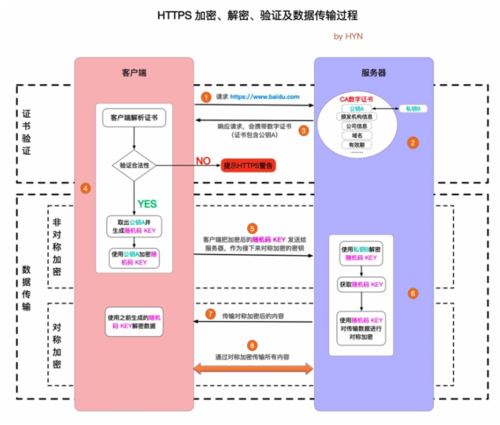

# 详解HTTP和HTTPS
## HTTP和HTTPS的基本概念
HTTP：是互联网上应用最为广泛的一种网络协议，是一个客户端和服务端请求和应答的标准（TCP），用于从WWW服务器传输超文本到本地浏览器的传输协议，
它可以使浏览器更加高效，使网络传输减少

HTTPS：是以安全为目标的HTTP通道，简单讲是HTTP的安全版，即HTTP下加入SSL层，HTTPS的安全基础是SSL，因此加密的详细内容就是需要SSL

HTTPS协议的主要作用可以分为两种：一种是建立一个信息安全通道，来保证数据传输的安全；另一种就是确认网站的真实性

## HTTP和HTTPS有什么区别
HTTP协议传输的数据都是未加密的，也就是明文的，因此使用HTTP协议传输隐私信息非常不安全，为了保证这些隐私数据能加密传输，于是网景公司设计了SSL协议，
用于对HTTP协议传输的数据进行加密，从而诞生了HTTPS

HTTP和HTTPS的区别主要如下：
1、https协议需要到ca申请证书，一般免费证书较少，因而需要一定的费用 
2、https是超文本传输协议，信息是明文传输，https则是具有安全性的ssl加密传输协议 
3、http和https使用的是完全不同的连接方式，用的端口也不一样，前者是80，后者是443 
4、http的连接很简单，是无状态的；https协议是由ssl+http协议构建的可进行加密传输、身份认证的网络协议，比http协议安全

## HTTPS的工作原理

https并非独立的通信协议，而是对http的扩展，保证了通信安全，也就是说https = http + ssl/tls

https的整个通信过程可以分为两个阶段：证书验证和数据传输阶段，数据传输阶段又可以分为非对称加密和对称加密两个阶段

1、客户端请求HTTPS网址，然后连接到server的443端口（HTTPS默认端口，类似于HTTP的80端口）

2、采用HTTPS协议的服务器必须要有一套数字CA证书，证书是需要审核的，并由专门的数字证书认证机构（CA）通过非常严格的审核之后颁发的电子证书，
颁发证书的同时会产生一个私钥和公钥。

私钥由服务端自己保存，不可泄漏；公钥则是附带在证书的信息中，可以公开。

证书本身也附带一个证书电子签名，这个签名用来验证证书的完整性和真实性，可以防止证书被篡改。

3、服务器响应客户端请求，将证书传递给客户端，证书包含公钥和大量其他信息，比如证书颁发机构信息，公司信息和证书有效期等。

4、客户端解析证书并对其进行验证 
（1）如果证书不是可信机构颁布，或者证书中的域名与实际域名不一致，或者证书已经过期，
就会向访问者显示一个警告，由其选择是否还要继续通信 
（2）如果证书没有问题，客户端就会从服务器证书中取出服务器的公钥A，然后客户端还会生成一个随机码KEY，并使用公钥A将其加密。

5、客户端把加密后的随机码KEY发送给服务器，作为后面对称加密的密钥。

6、服务器在收到随机码KEY之后会使用私钥B将其解密，经过以上这些步骤，客户端和服务器终于建立了安全连接，完美解决了对称加密的密钥泄漏问题，接下来就可以用对称加密进行通信了

7、服务器使用密钥（随机码KEY）对数据进行对称加密并发送给客户端，客户端使用相同的密钥解密（随机码KEY）数据。

8、双方使用对称加密愉快的传输所有数据。

## HTTPS的缺点
* 在相同网络环境中，HTTPS相比HTTP无论是响应时间还是耗电量都有大幅度上升

* HTTPS的安全是有范围的，在黑客攻击、服务器劫持等情况下起不到作用

* 在现有的证书机制下，中间人攻击依然有可能发生

* HTTPS需要更多的服务器资源，也会导致成本的升高

## 参考文档
* [HTTP请求行、请求头、请求体详解](https://www.jianshu.com/p/eb3e5ec98a66)

